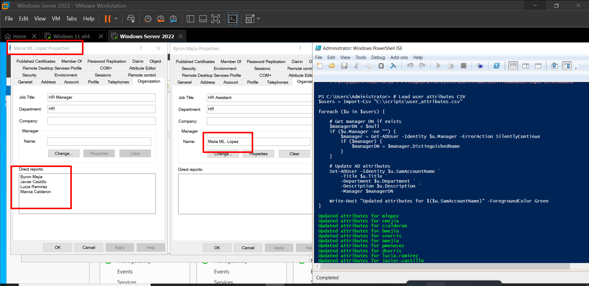
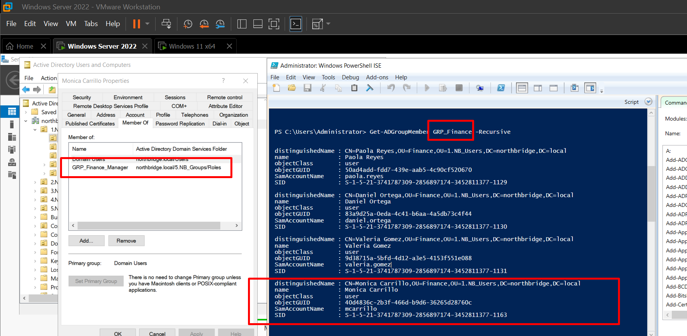
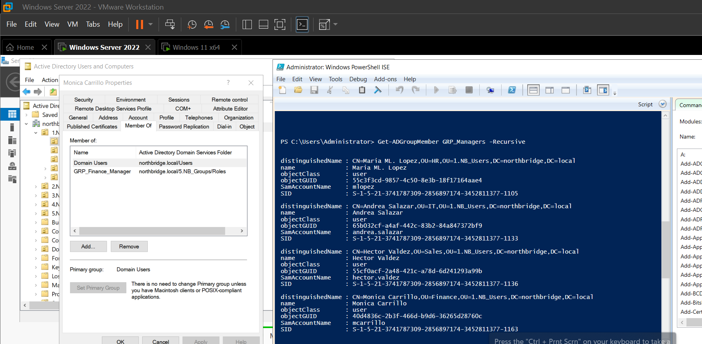

# Active Directory Identity Management & RBAC Automation 

This project simulates a small enterprise **Identity and Access Management (IAM)** environment built using **Active Directory Domain Services (AD DS)** and **PowerShell automation**.

The objective of this lab was to design a structured directory environment while implementing **Role-Based Access Control (RBAC)** using security groups, nested group architecture, and automated user provisioning.

Instead of relying on manual configuration through the graphical interface, most of the infrastructure in this project was created and managed using **PowerShell scripts**, which reflects how identity infrastructure is typically administered in enterprise environments.

This project demonstrates practical knowledge of:

- Active Directory administration
- Identity and Access Management (IAM)
- RBAC design and implementation
- PowerShell automation
- Organizational Unit architecture
- Group nesting strategies
- Automated user provisioning
- Infrastructure troubleshooting

---

# Environment Architecture

The simulated domain environment was built using the following infrastructure:

Domain: northbridge.local  
Domain Controller: Windows Server 2022  
Client Machine: Windows 10  

Active Directory was deployed as the central identity service, while PowerShell was used to automate the creation and management of directory objects.

Automation is important because large organizations often manage **thousands of users**, making manual administration inefficient and error-prone.

---

# 1. Organizational Unit Structure Design

The first step in designing an Active Directory environment is creating a **clear Organizational Unit structure**.

Organizational Units are used to:

- Organize directory objects
- Apply Group Policies
- Delegate administrative permissions
- Create logical security boundaries

A structured OU hierarchy improves maintainability and scalability.

The root structure created for this lab includes:

- Users
- Computers
- Groups
- Admin

This separation ensures that different object types can be managed independently.

---

# 2. Department-Based User Organization

Users were organized by department to simulate a typical corporate environment.

Departments created:

- Finance
- HR
- IT
- Sales

Separating users into departmental OUs allows administrators to:

- Apply department-specific policies
- Delegate control to department administrators
- Organize identities logically

This design also simplifies identity lifecycle management.

---

# 3. Computer Organizational Structure

Computer objects were separated based on device type:

- Workstations
- Laptops
- Servers

This design is important because different types of devices often require different configurations.

For example:

- Workstations may require standard user policies
- Laptops may require additional security policies
- Servers require stricter security controls

Organizing computers this way allows administrators to apply **targeted Group Policies**.

---

# 4. Creating Department Security Groups

Department groups represent the **first layer of RBAC access control**.

Examples include:

- GRP_Finance
- GRP_HR
- GRP_IT
- GRP_Sales

These groups represent **department-level permissions** and serve as the parent groups in the RBAC model.

In this project, these groups were created using **PowerShell scripts**, allowing the process to be automated and repeatable.

---

# 5. Creating Role-Based Groups

Role groups represent specific job functions within each department.

Examples include:

- GRP_Finance_Manager
- GRP_Finance_Analyst
- GRP_IT_Technician

Instead of assigning permissions directly to users, users are assigned to **role groups**, which are then nested inside department groups.

This approach improves scalability and simplifies access management.

---

# 6. Preparing the User CSV File

To automate user creation, a CSV file was prepared containing structured identity data.

The CSV file includes attributes such as:

- First Name
- Last Name
- Department
- Title
- Manager
- EmployeeID

Using a CSV allows administrators to create many users simultaneously through automation.

---

# 7. Automated User Provisioning with PowerShell

Users were created automatically using a PowerShell script that reads the CSV file and generates user accounts.

Automation provides several benefits:

- Reduces manual errors
- Speeds up user provisioning
- Allows repeatable infrastructure deployment

This approach reflects real enterprise onboarding workflows.

---

# 8. Administrative Role Definition

Administrative roles were documented separately to define privileged access levels.

This helps ensure that privileged accounts are clearly identified and properly managed.

---

# 9. Creating Administrative Accounts

Following security best practices, administrative accounts were created separately from standard user accounts.

Example:

standard user → jsmith  
administrative account → jsmith-admin  

Separating privileged accounts reduces the risk of credential compromise.

---

# 10. Verifying Group Membership

PowerShell was used to verify that users were assigned to the correct groups.

Verification steps are essential when deploying identity infrastructure to ensure that access policies are functioning correctly.

---

# 11. Assigning Identity Attributes

Additional attributes were assigned to users using PowerShell automation.

Attributes assigned include:

- Department
- Title
- Manager
- EmployeeID

These attributes are commonly used by enterprise identity systems for:

- Identity governance
- Access automation
- Organizational reporting

---

# 12. Automating Role Group Creation

Role-based groups were created using PowerShell scripts.

Automating group creation ensures that:

- Naming conventions remain consistent
- Deployment is repeatable
- Human error is minimized

---

# 13. Assigning Users to Global Role Groups

Users were also assigned to broader global role groups such as:

- GRP_Managers
- GRP_Analysts

These groups represent organization-wide roles that may apply across multiple departments.

---

# 14. Assigning Users to RBAC Role Groups

Users were assigned to role groups rather than directly to department groups.

This allows role-based access to be managed independently from department membership.

---

# 15. RBAC Group Nesting (Role → Department)

Role groups were nested inside department groups.

Example:

GRP_Finance_Manager → GRP_Finance  
GRP_Finance_Analyst → GRP_Finance  

This allows department permissions to be inherited through role membership.

---

# 16. RBAC Global Nesting

Role groups were also nested into global role groups.

Example:

GRP_Finance_Manager → GRP_Managers

This allows permissions to propagate through multiple levels of the RBAC hierarchy.

---

# 17. Validating Nested Group Membership

Users inherit permissions through nested groups.

PowerShell was used to confirm that the nesting structure worked correctly.

---

---

## 18. Testing RBAC Nesting

RBAC nesting was tested using PowerShell to confirm that users inherit permissions through nested security groups.

Example command used for validation:

`Get-ADGroupMember GRP_Finance -Recursive`

The `-Recursive` parameter allows administrators to display users that belong to nested groups and confirms that the RBAC hierarchy is functioning correctly.

---

## 19. Testing Manager Group Access

Additional validation was performed on the **Managers global group** to confirm that permissions propagate correctly through the RBAC hierarchy.

This ensures that users assigned to role groups inherit the appropriate department and global permissions.

---

## Real-World Issue Encountered

During testing, an issue appeared when users were moved between **Organizational Units (OUs)**.

Active Directory automatically disabled **permission inheritance**, which caused RBAC behavior to break.

### Symptoms observed

- Missing inherited permissions  
- Unexpected group membership results  
- Incorrect access validation during RBAC testing  

This situation can occur when directory objects are moved between containers with different security configurations.

### Resolution

The issue was resolved by re-enabling inheritance in the user security settings:

User Properties → Security → Advanced → Enable inheritance

Once inheritance was restored, RBAC functionality returned to normal.

---

## Skills Demonstrated

This project demonstrates practical skills relevant to enterprise IT infrastructure and identity management roles:

- Active Directory administration  
- RBAC architecture design  
- PowerShell automation  
- Identity and Access Management (IAM)  
- Organizational Unit architecture  
- Group nesting strategies  
- Automated user provisioning  
- Security best practices  
- Infrastructure troubleshooting  

---

## Technologies Used

- Windows Server 2022  
- Active Directory Domain Services  
- PowerShell  
- CSV-based automation  
- RBAC access model
