# Active Directory Enterprise RBAC Environment with PowerShell Automation


This project simulates a **real enterprise Active Directory environment** designed to demonstrate identity management, Role-Based Access Control (RBAC), group nesting strategies, and PowerShell automation.

The goal of this project was to understand how **identity, permissions, and access inheritance work in enterprise infrastructure environments**, while building a structured and automated Active Directory deployment.

The environment follows common enterprise best practices including:

- Structured Organizational Unit (OU) hierarchy
- Role-Based Access Control (RBAC)
- Group nesting strategies
- Automated user provisioning with PowerShell
- Attribute-based identity management
- Administrative account separation

---

# Project Architecture

The environment was deployed using a simulated domain:


northbridge.local


Infrastructure components include:

- Windows Server 2022 Domain Controller
- Active Directory Domain Services
- PowerShell automation scripts
- RBAC group architecture
- Organizational Unit hierarchy
- Automated user creation from CSV files

---

# 1. Organizational Unit (OU) Design

Before creating users or groups, the first step was designing a **scalable OU structure**.

Separating objects into logical containers allows administrators to apply:

- Group Policies
- Delegation of administration
- Security boundaries
- Organizational identity management

Root OU structure:

- Users
- Computers
- Groups
- Admin

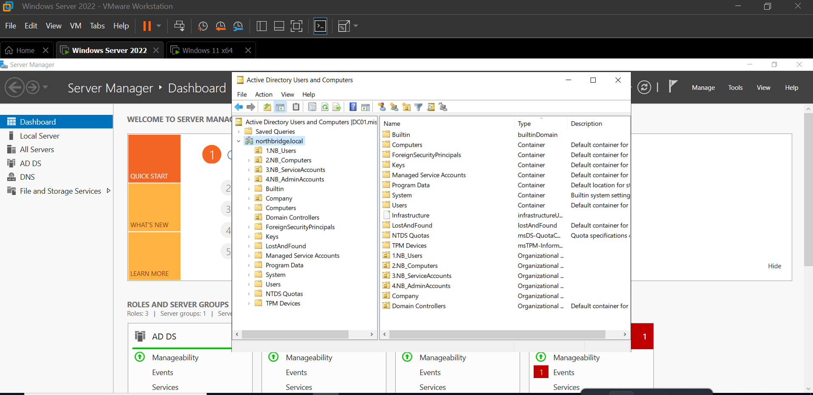

---

# 2. Department-Based User Structure

Users were organized by department to simulate a corporate structure.

Departments created:

- Finance
- HR
- IT
- Sales

This structure allows department-level administration and easier policy management.

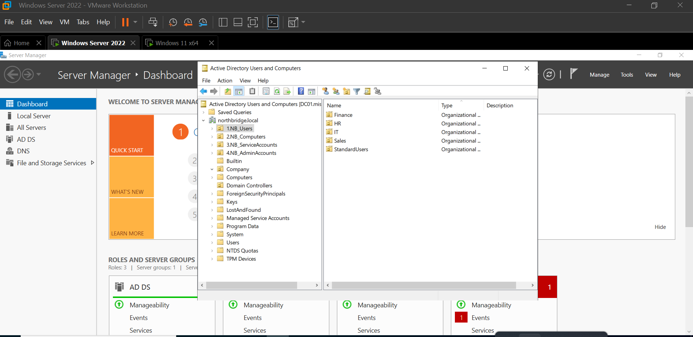

---

# 3. Computer Organization

Computer objects were separated by device type:

- Workstations
- Laptops
- Servers

This allows targeted **Group Policy deployment and device lifecycle management**.

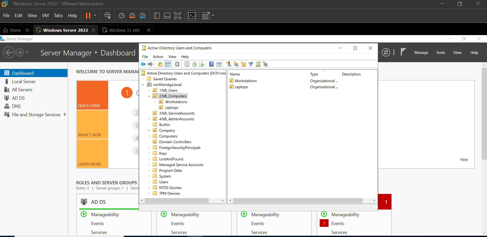

---

# 4. Creating Department Security Groups

Department groups represent **department-wide access permissions**.

Examples:

- GRP_Finance
- GRP_HR
- GRP_IT
- GRP_Sales

These groups serve as the first level of RBAC access control.

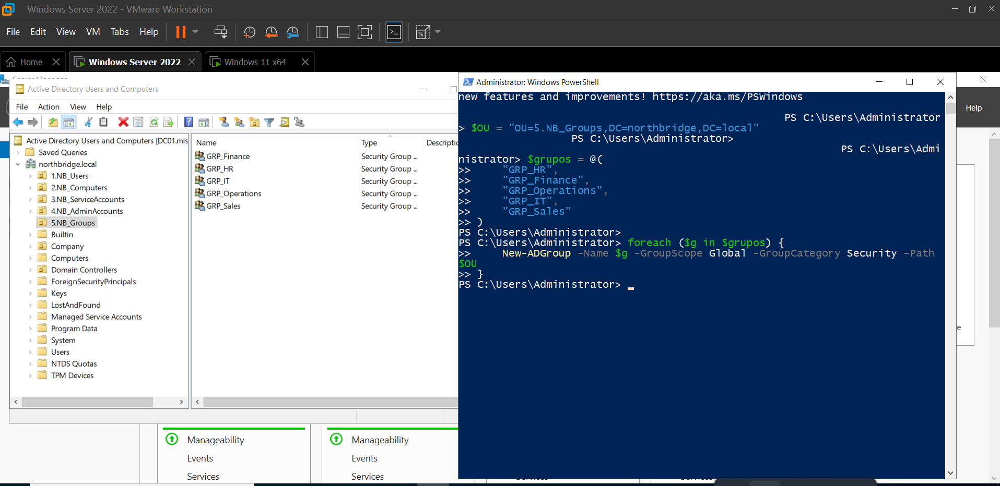

---

# 5. Creating Role-Based Groups (RBAC Level 2)

Role groups represent **specific roles inside each department**.

Examples:

- GRP_Finance_Manager
- GRP_Finance_Analyst
- GRP_IT_Technician

Users are assigned to **role groups instead of department groups directly**.

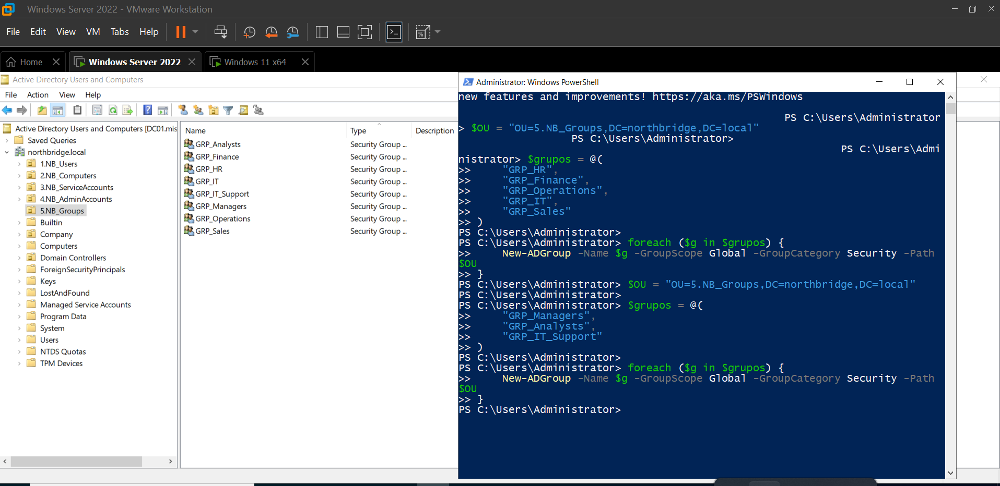

---

# 6. Preparing the User CSV

User data was prepared in a CSV file to automate account creation.

The CSV contains identity attributes such as:

- First Name
- Last Name
- Department
- Job Title
- Manager
- EmployeeID

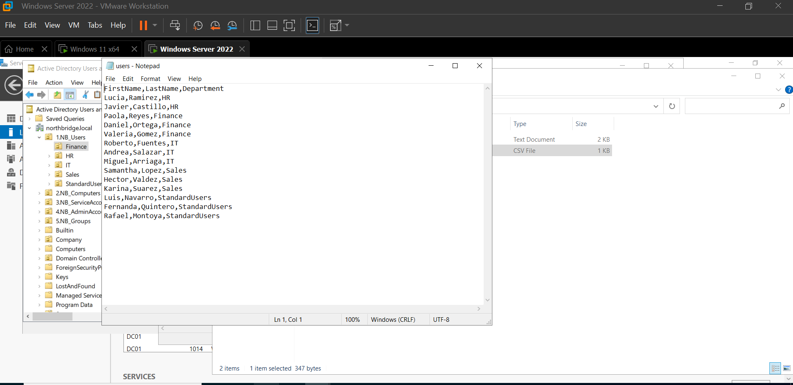

---

# 7. Automated User Creation with PowerShell

Users were automatically created using PowerShell and imported from the CSV file.

This approach reflects real enterprise onboarding processes where **automation is required to provision large numbers of users efficiently**.

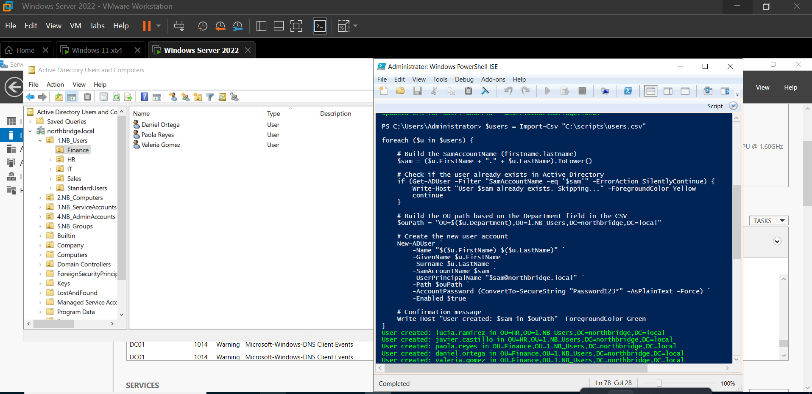

---

# 8. Defining Administrative Roles

Administrative roles were documented and structured separately from standard users.

This supports governance and reduces privilege exposure.

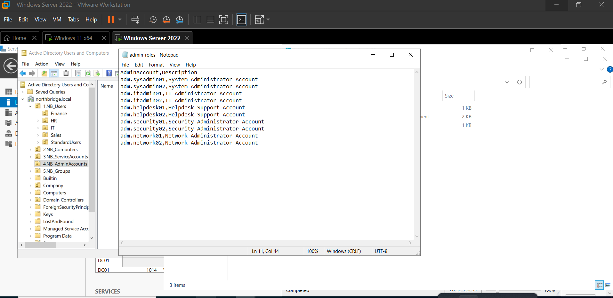

---

# 9. Creating Administrative Accounts

Administrative accounts were created separately following security best practices.

Example structure:


username → standard account
username-admin → administrative account


Separating privileged accounts reduces the risk of credential compromise.

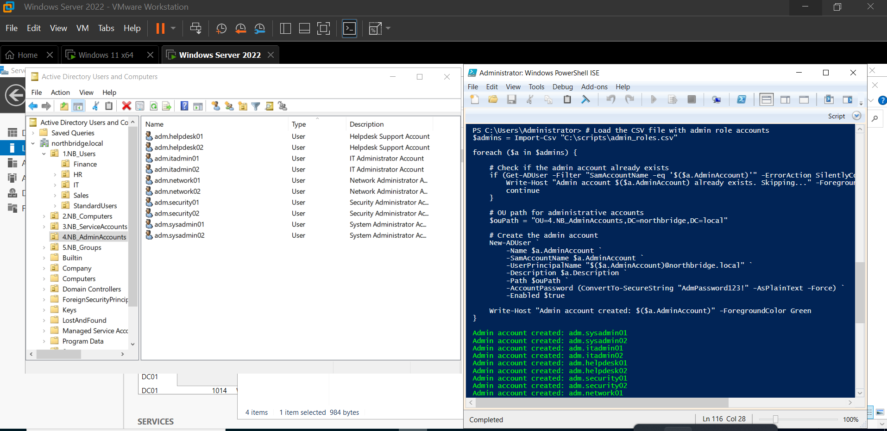

---

# 10. Validating Group Memberships

PowerShell was used to verify that users were assigned to the correct groups.

This validation step ensures that RBAC policies are applied correctly.

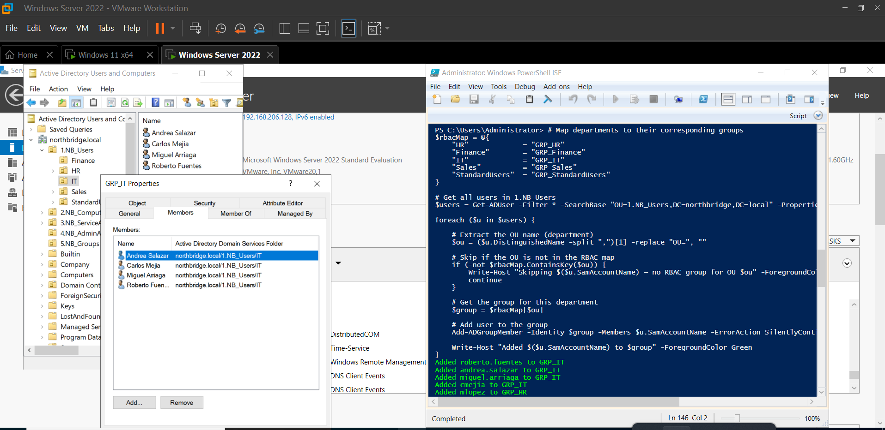

---

# 11. Assigning Identity Attributes

Additional identity attributes were assigned to users to simulate enterprise directory data.

Attributes included:

- Department
- Title
- Manager
- EmployeeID

These attributes are commonly used in identity governance and automation systems.


---

# 12. Automating Role Group Creation

RBAC role groups were automatically created using PowerShell scripts.

This reduces manual work and ensures consistency in group creation.

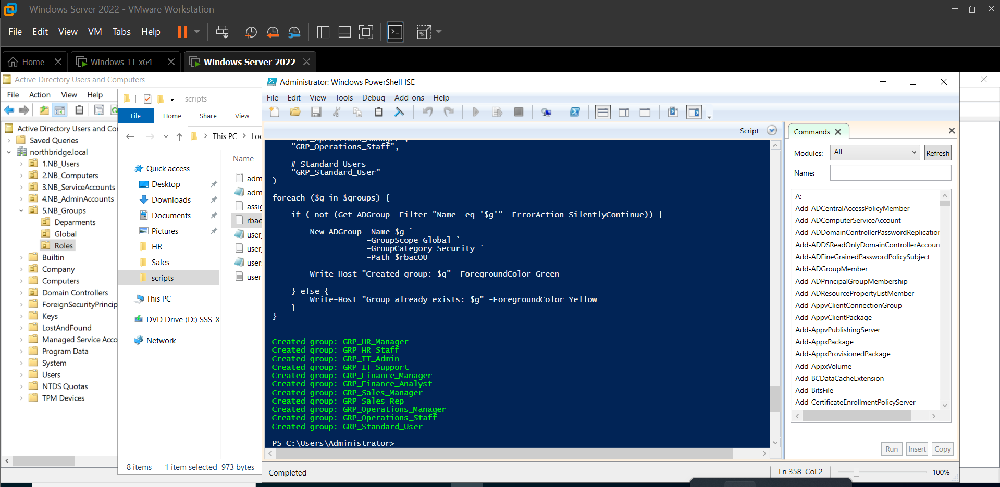

---

# 13. Assigning Users to Global Role Groups

Users were assigned to broader role groups such as:

- GRP_Managers
- GRP_Analysts

This supports hierarchical access models.

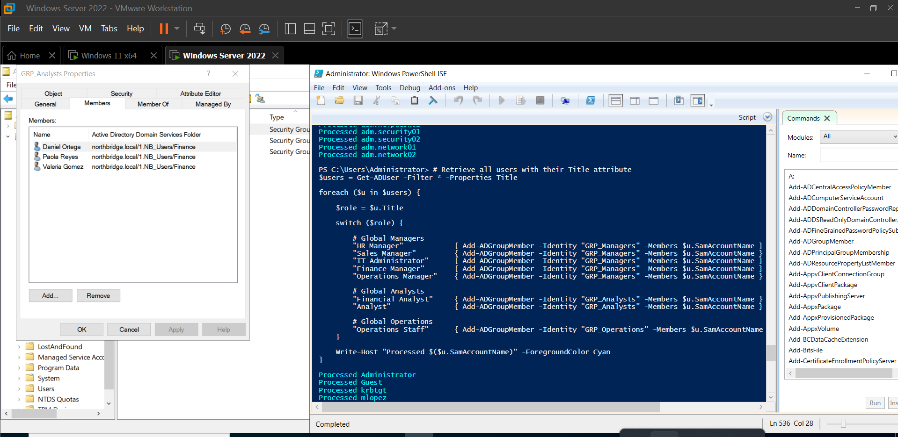

---

# 14. Assigning Users to RBAC Role Groups

Each user was assigned to their **RBAC role group**, rather than directly to department groups.

This approach simplifies long-term access management.

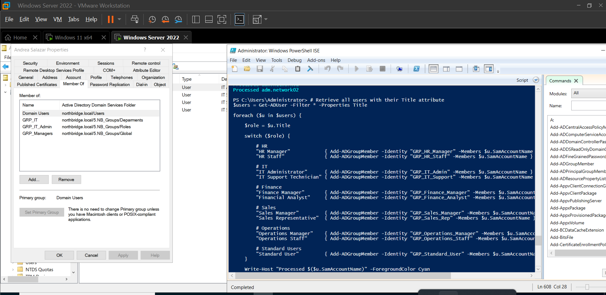

---

# 15. RBAC Group Nesting (Role → Department)

Role groups were nested into department groups.

Example:


GRP_Finance_Manager → GRP_Finance
GRP_Finance_Analyst → GRP_Finance


This allows department access to be inherited through role membership.

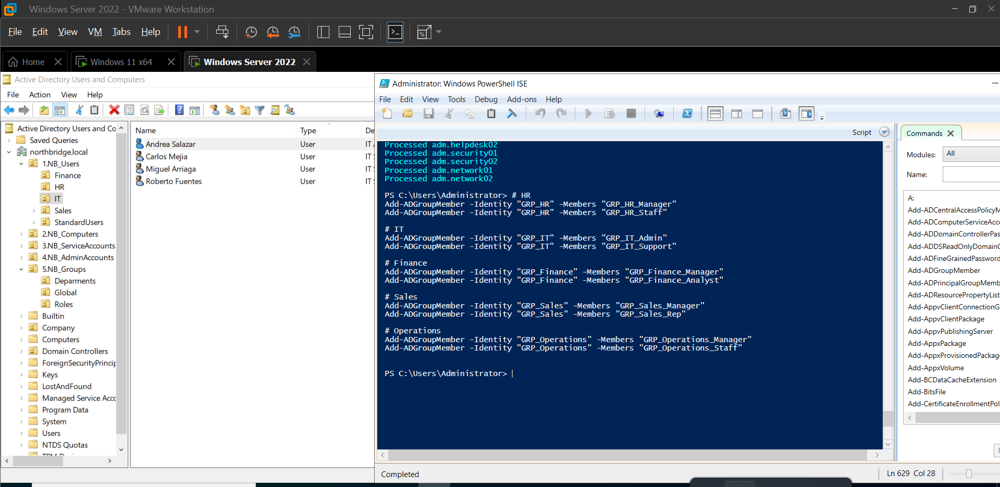

---

# 16. RBAC Nesting with Global Groups

Role groups were also nested into global role groups.

Example:


GRP_Finance_Manager → GRP_Managers


This supports enterprise-wide privilege structures.

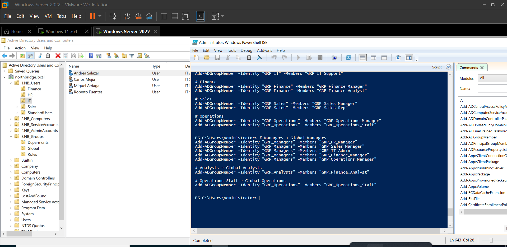

---

# 17. Adding Users Through Nested Groups

Users inherit permissions through nested group relationships.

This confirms the RBAC model works correctly.

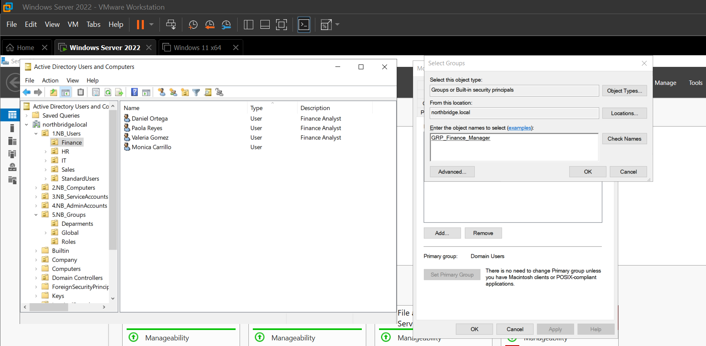

---

# 18. Testing RBAC Nesting

RBAC nesting was tested using PowerShell.

Example command:

```powershell
Get-ADGroupMember GRP_Finance -Recursive

The -Recursive parameter allows administrators to view users who belong to nested groups.

19. Testing Global Manager Group

Additional validation confirmed that manager-level permissions worked correctly through nested groups.

Real-World Issue Encountered

During testing, an issue appeared when users were moved between Organizational Units.

Active Directory disabled permission inheritance, which caused RBAC behavior to break.

Symptoms included:

Missing inherited permissions

Unexpected group behavior

Incorrect access validation

The issue was resolved by re-enabling inheritance in the user security settings:

User Properties
→ Security
→ Advanced
→ Enable inheritance

Once inheritance was restored, RBAC functionality returned to normal.

Skills Demonstrated

This project demonstrates practical skills relevant to enterprise IT infrastructure and identity management roles:

Active Directory administration

RBAC architecture design

PowerShell automation

Identity and Access Management (IAM)

Organizational Unit architecture

Group nesting strategies

Automated user provisioning

Security best practices

Infrastructure troubleshooting

Technologies Used

Windows Server 2022

Active Directory Domain Services

PowerShell

CSV automation

RBAC access model
