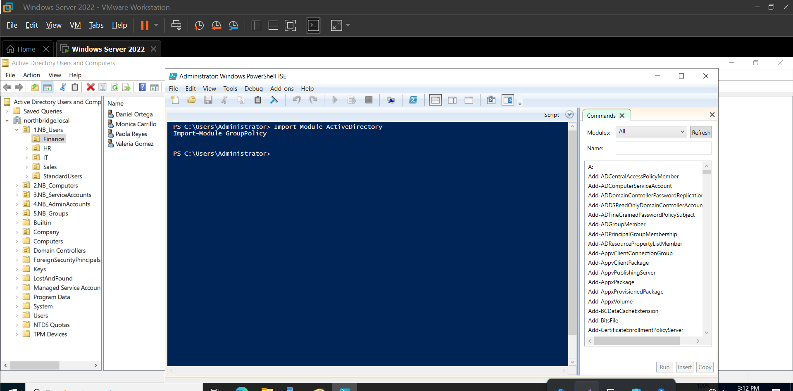
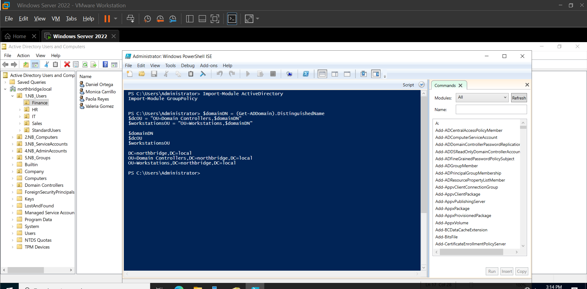
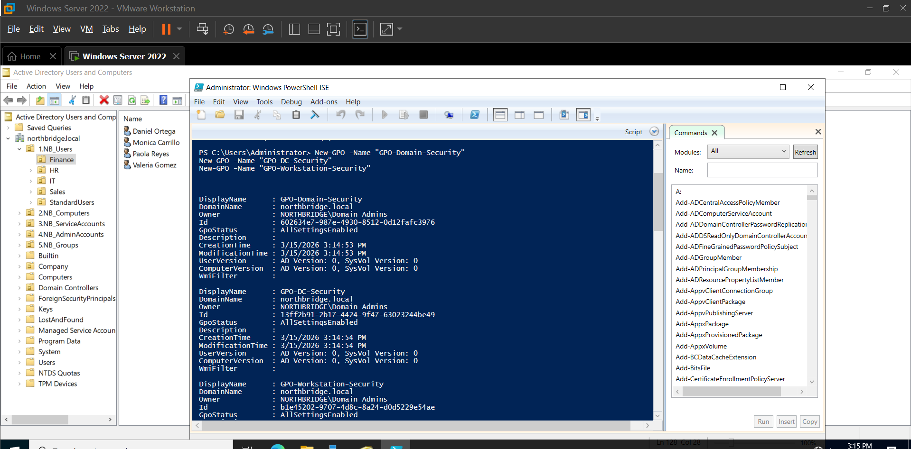
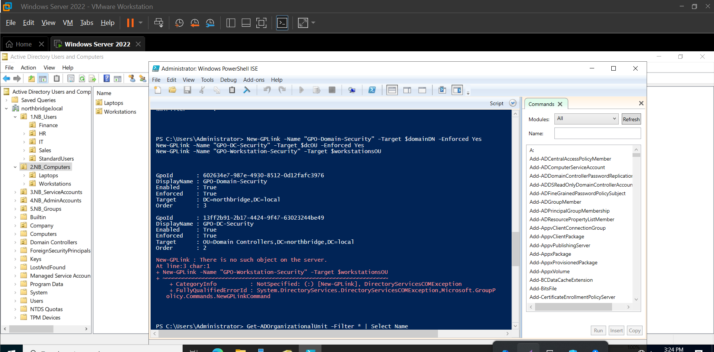
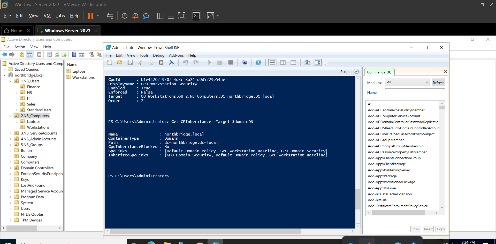
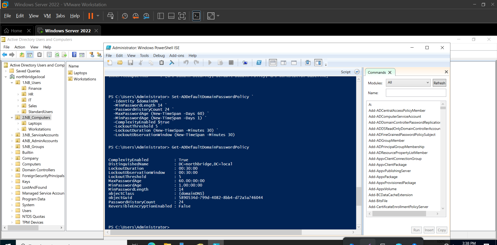
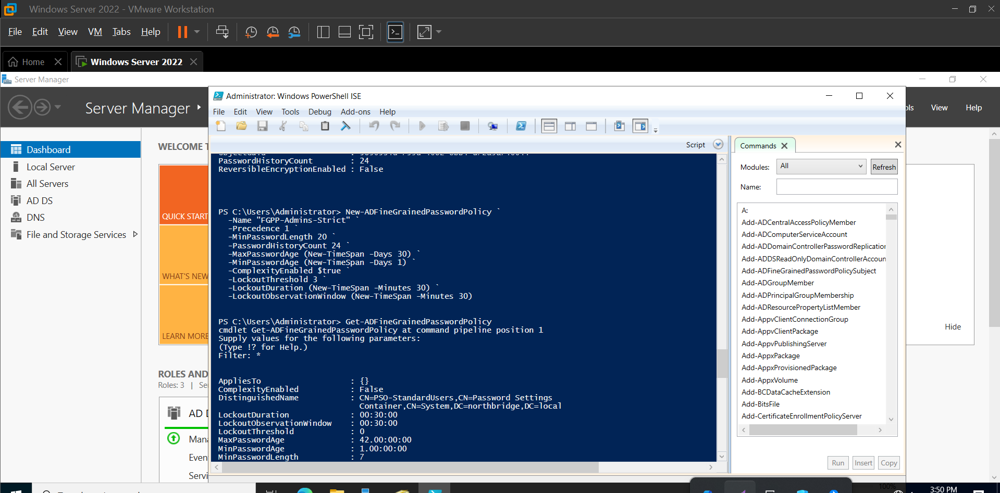
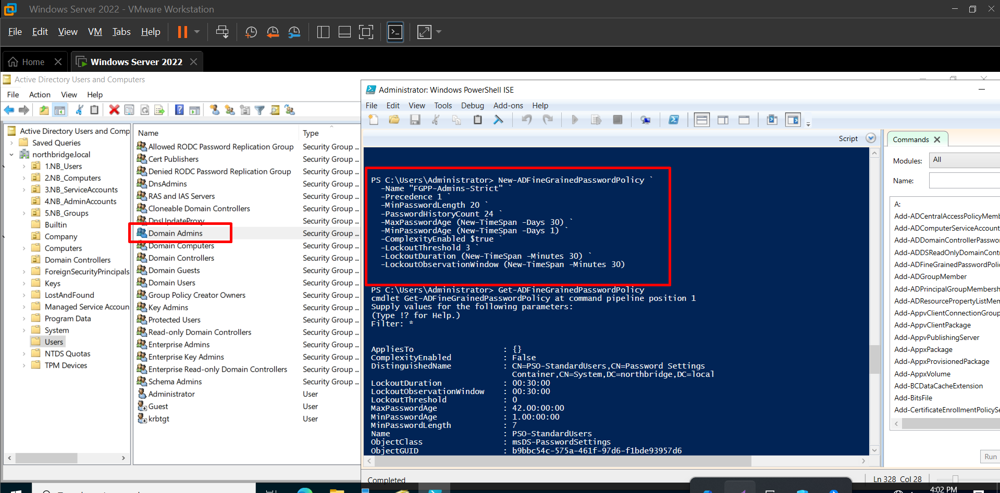
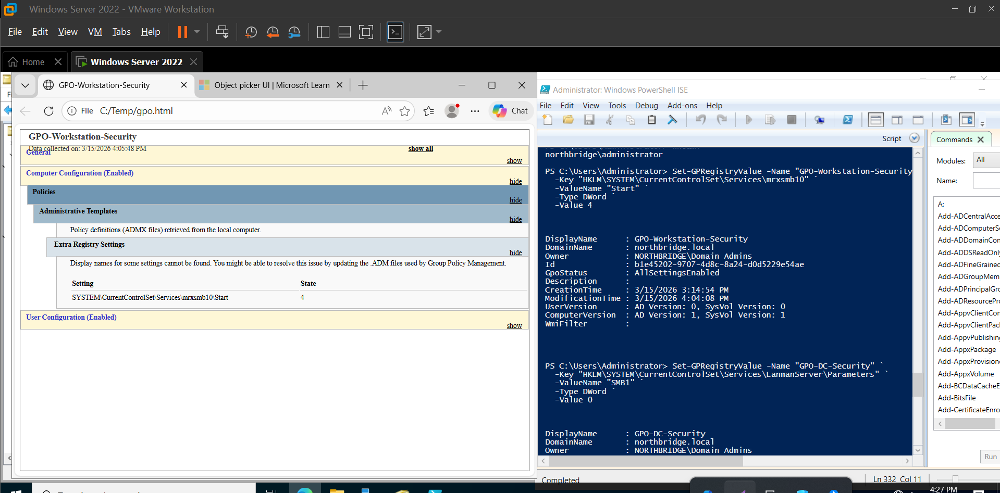
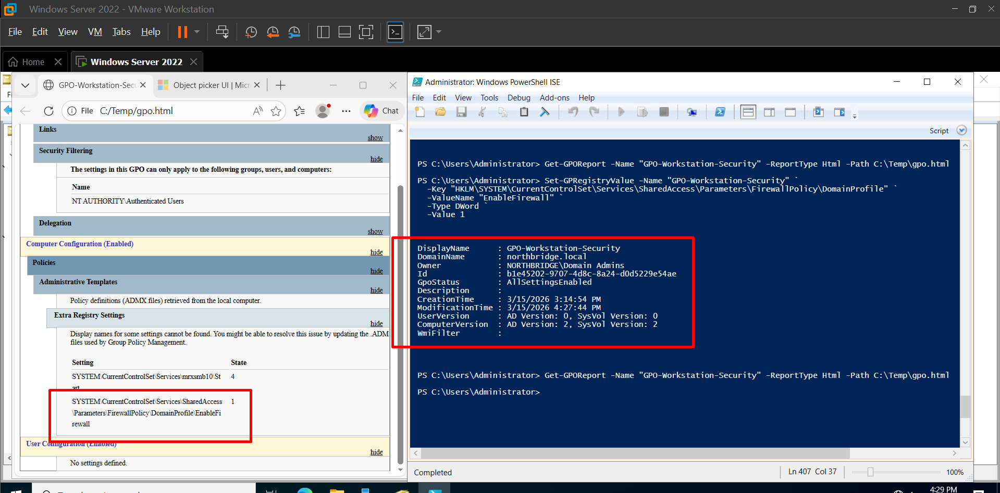

# Active Directory Security Hardening Lab

## Project Overview

This project focuses on implementing a structured security baseline in an Active Directory environment using Group Policy and PowerShell.

The objective was not just to configure settings, but to design them in a controlled and scalable way. Instead of applying changes directly to default configurations, policies were separated, scoped, and validated to reflect how enterprise environments are managed.

---

## Objectives

- Implement a structured Active Directory security baseline  
- Apply Group Policy in a controlled and scalable way  
- Separate policies based on system roles (Domain, Domain Controllers, Workstations)  
- Enforce modern security practices (disable legacy protocols, strengthen authentication)  
- Use PowerShell to automate configuration  
- Validate policy application and troubleshoot issues  

---

## Environment / Architecture

- Domain: `northbridge.local`  
- Domain Controller: Windows Server 2022  
- Client Machine: Windows 11  

Technologies used:

- Active Directory Domain Services (AD DS)  
- Group Policy Management  
- PowerShell  

This setup was chosen to simulate a small enterprise environment where policies are centrally managed and applied across different types of systems.

---

## Design Decisions

### GPO Separation

Separate GPOs were created instead of modifying the Default Domain Policy:

- Domain Security  
- Domain Controller Security  
- Workstation Security  

This reduces risk and makes it easier to manage and troubleshoot policies independently.

---

### OU-Based Targeting

Policies were applied based on Organizational Units.

This ensures that each type of system receives only the configurations relevant to it, avoiding unintended impact.

---

### PowerShell Automation

PowerShell was used to create and manage policies.

This allows repeatability, reduces manual errors, and reflects how configurations are handled in real environments.

---

## Implementation

### 1. Load Required Modules

PowerShell modules for Active Directory and Group Policy were loaded to enable automation and scripting.



---

### 2. Define Domain Paths

Distinguished Names and OU paths were defined to ensure that all objects and policies are created in the correct locations.



---

### 3. Create Security GPOs

GPOs were created to separate security controls by scope, allowing each layer of the environment to be managed independently.



---

### 4. Validate GPO Linking

An incorrect GPO link was initially applied, which prevented policies from working as expected.



After correcting the target, the policy applied properly:


This highlights the importance of verifying scope after configuration.

---

### 5. Link GPOs to Correct Targets

GPOs were linked to the appropriate OUs to ensure correct application across Domain, Domain Controllers, and Workstations.



---

### 6. Configure Domain Password Policy

A domain-level password policy was configured to enforce baseline security requirements such as password length, history, and lockout settings.



---

### 7. Create Fine-Grained Password Policy

A stricter password policy was created specifically for privileged accounts.

This addresses the limitation of domain policies applying equally to all users.



---

### 8. Apply FGPP to Administrative Accounts

The stricter policy was applied to privileged users to ensure stronger authentication controls for high-risk accounts.



---

### 9. Disable SMBv1

SMBv1 was disabled to remove a legacy protocol with known vulnerabilities, reducing the attack surface.



---

### 10. Enable Firewall via GPO

Firewall settings were enforced centrally using Group Policy to ensure consistency across all systems.



---

## Validation / Testing

After applying the configurations, policies were verified using system tools and PowerShell:

```powershell
gpresult /r
Get-ADFineGrainedPasswordPolicy
Get-NetFirewallProfile
Get-WindowsOptionalFeature -Online -FeatureName SMB1Protocol
