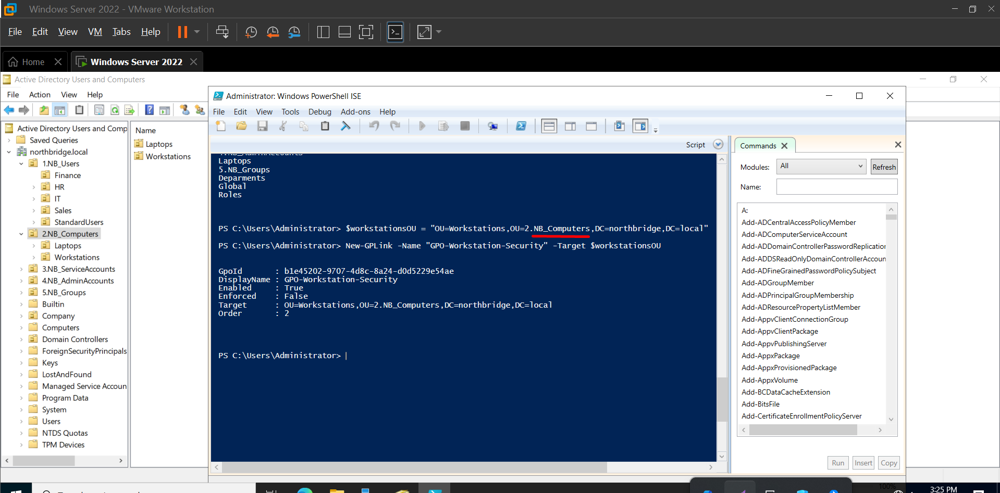

# Active Directory Security Hardening Lab
### Implementing a security baseline using Group Policy and PowerShell

This project focuses on securing an Active Directory environment by applying a structured set of security policies using Group Policy Objects (GPOs) and PowerShell.

The goal was not only to configure security settings, but to design them in a way that reflects how enterprise environments are managed.

---

# Environment

- Domain: `northbridge.local`
- Domain Controller: Windows Server 2022
- Client: Windows 11

---

# Security Policy Design

## Separation of GPOs

Instead of modifying the Default Domain Policy, separate GPOs were created:

- `GPO-Domain-Security`
- `GPO-DC-Security`
- `GPO-Workstation-Security`

This approach improves control and reduces risk. Each layer of the environment can be managed independently, making troubleshooting and auditing more straightforward.

---

# PowerShell-Based Implementation


All configurations were implemented using PowerShell.

This ensures:
- Consistent deployment
- Repeatability
- Reduced manual errors

---

# GPO Creation and Linking


Each GPO targets a specific scope:

- Domain → global security settings  
- Domain Controllers → stricter controls  
- Workstations → endpoint security  


Correct OU targeting is critical. Policies only apply as expected when the structure is properly designed.

---

# GPO Linking Validation

An incorrect link was initially applied:


After correcting the target:



This highlights the importance of validating GPO scope and inheritance after deployment.

---

# Password Policy Configuration


The domain password policy enforces baseline requirements such as:

- Minimum length  
- Password history  
- Account lockout  

However, this level of control is not sufficient for privileged accounts.

---

# Fine-Grained Password Policy (FGPP)


A stricter password policy was applied to administrative accounts.

This allows:
- Different security requirements for different groups  
- Stronger protection for privileged identities  
- Better alignment with least privilege principles  

---

# Disabling SMBv1


SMBv1 was disabled due to known vulnerabilities and its association with major exploits such as WannaCry.

Removing legacy protocols reduces the attack surface significantly.

---

# LDAP Signing

LDAP signing was enforced to secure authentication traffic.

Without it:
- Credentials can be intercepted  
- Authentication can be manipulated  

Enabling it ensures integrity and reduces the risk of man-in-the-middle attacks.

---

# PowerShell v2 Removal

PowerShell v2 was disabled because it lacks modern security controls and logging capabilities.

Keeping only supported versions improves visibility and reduces exposure to known attack techniques.

---

# Firewall Configuration via GPO

Firewall settings were applied centrally using Group Policy.

Benefits include:
- Consistent configuration across all systems  
- No dependency on local settings  
- Easier enforcement and management  

---

# Administrative Account Strategy

Administrative accounts were separated from standard user accounts.

This reduces risk by:
- Limiting exposure of privileged credentials  
- Preventing misuse during daily activities  

High-privilege accounts should only be used when required.

---

# Auditing Configuration

Audit policies were configured to track:

- Logon events  
- Account changes  
- Privilege usage  

This enables detection of suspicious activity and supports incident investigation.

---

# Validation and Testing

All configurations were verified after deployment.

```powershell
gpresult /r
Get-ADFineGrainedPasswordPolicy
Get-NetFirewallProfile
Get-WindowsOptionalFeature -Online -FeatureName SMB1Protocol

---

# What I Learned

Working on this project helped me move from just configuring Active Directory to actually understanding how security should be designed.

Some of the main takeaways:

- Separating GPOs by scope (Domain, DCs, Workstations) makes the environment easier to manage and reduces the impact of misconfigurations  
- The Default Domain Policy should remain minimal to avoid unnecessary risk and complexity  
- PowerShell is essential for consistency and scalability, especially when applying multiple configurations  
- Not all accounts should follow the same security policies — privileged accounts require stricter controls  
- Disabling legacy components like SMBv1 and PowerShell v2 is critical to reduce exposure to known attack vectors  
- Security is not only about applying configurations, but also about validating that they are actually enforced  
- Small mistakes, such as incorrect GPO linking, can silently affect the entire environment if not properly tested  

Overall, this project reinforced the importance of combining **structure, automation, and validation** when working with identity infrastructure.
