# Active Directory Delegation Model — Northbridge

## Project Overview

This project focuses on designing and implementing a structured **delegation model in Active Directory** using a simulated enterprise environment.

In many organizations, operational tasks like password resets or user updates are handled by Domain Admins. This creates unnecessary risk and makes the environment harder to scale.

In this lab, I redesigned that approach by distributing responsibilities across different roles (Helpdesk, HR, and Managers) using **group-based delegation, OU scoping, and PowerShell automation**.

The result is a cleaner, more secure, and more realistic identity management model aligned with how enterprise environments operate.

---

## Objectives

- Implement Role-Based Access Control (RBAC) in Active Directory  
- Delegate permissions using security groups instead of users  
- Apply least privilege across operational roles  
- Use PowerShell (dsacls) for repeatable configuration  
- Validate both successful and denied scenarios  
- Collect audit evidence from domain controller logs  

---

## Environment / Architecture

- **Domain:** northbridge.local  
- **Domain Controller:** Windows Server 2022  
- **Client:** Windows 11 (joined to domain with RSAT installed)  

### Tools Used

- Active Directory Users and Computers (ADUC)  
- PowerShell (ActiveDirectory module)  
- DSACLS  
- Windows Security Logs  

### How the environment was used

- The **client machine** was used to simulate real user/admin activity (Helpdesk, HR, Managers)  
- The **domain controller** was used for:
  - applying delegation  
  - validating permissions  
  - collecting audit logs  

This separation reflects how things actually work in production environments.

---

## Design Decisions

### OU Structure

Users are organized under:

- `OU=1.NB_Users`
- `OU=HR` (scoped for HR operations)
- `OU=DisabledUsers` (for offboarding)

Permissions were applied at the OU level to control exactly where each role can operate.

---

### Group-Based Delegation

All permissions were assigned to **delegation groups (DLG_*)**, not individual users.

Examples:

- DLG_Helpdesk_Reset_Users  
- DLG_HR_Modify_Users  
- DLG_Managers_Read_Departments  

This makes the model easier to maintain and much cleaner when validating or troubleshooting.

---

### Separation of Duties

Each role has a clear responsibility:

- Helpdesk → operational support  
- HR → identity lifecycle  
- Managers → read-only visibility  

This prevents privilege overlap and keeps responsibilities clearly defined.

---

## Implementation

### 1: Initial AD Structure Validation

Before applying any delegation, I verified that OUs, users, and attributes were correctly created.

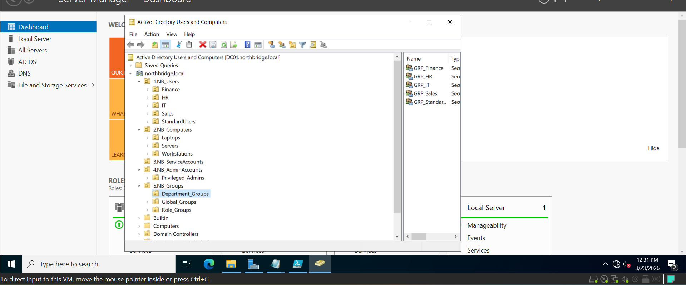

---

### 2: Delegation Groups OU

Created a dedicated OU for delegation groups to separate them from business roles.

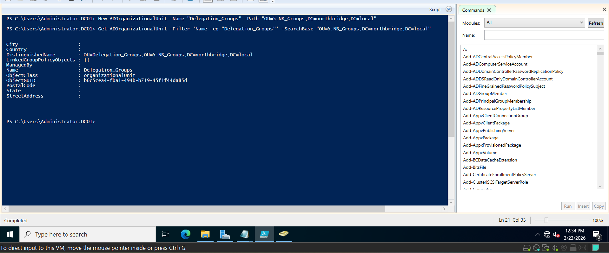

---

### 3: Delegation Groups Creation

Created all DLG_* groups using a consistent naming convention.

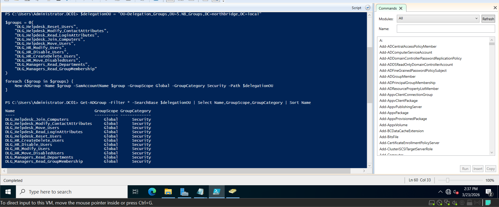

---

### 4: Group Membership Assignment

Assigned accounts like:

- adm.helpdesk01 → Helpdesk groups  
- mlopez → HR groups  
- managers → read-only groups  

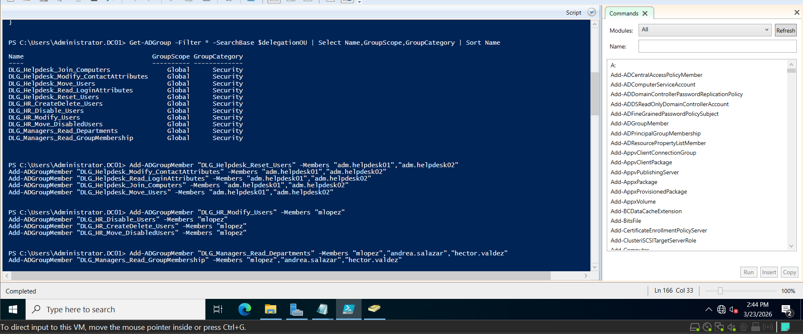

---

### 5: Naming Standard Validation

Confirmed that all delegation groups follow the same naming pattern.

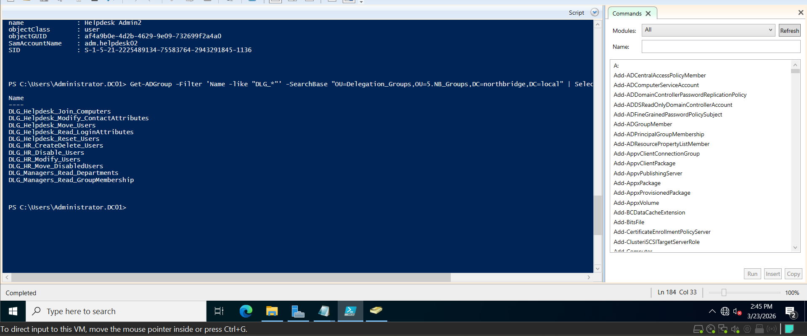

---

### 6: Helpdesk Password Reset Delegation

Delegated password reset capability at the user OU level using dsacls.

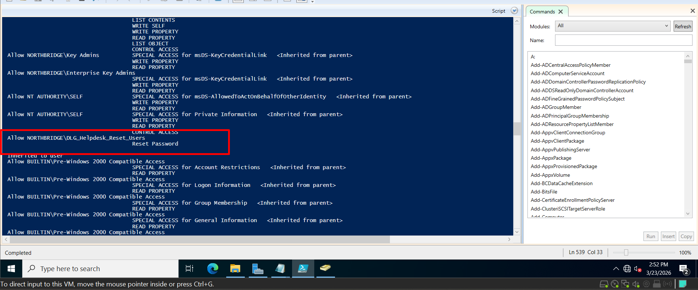

---

### 7: Helpdesk Contact Attribute Delegation

Allowed Helpdesk to update operational attributes like phone and description.

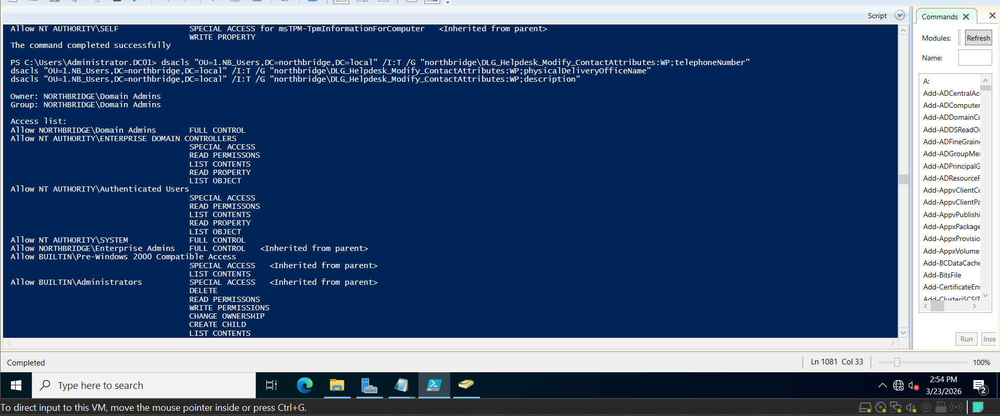

---

### 10:Helpdesk — Join Computers Delegation

During the delegation process, an initial attempt was made to assign validated write permissions for DNS and Service Principal Name (SPN) attributes using `dsacls`.

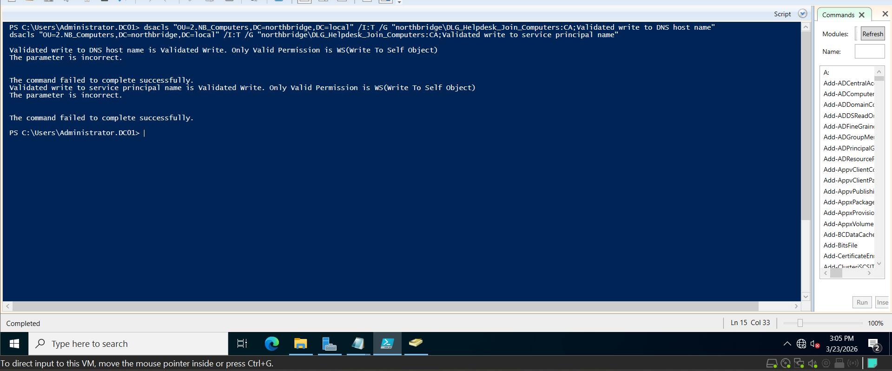

This resulted in an error indicating that these attributes require **Write Self (WS)** permissions, which cannot be assigned using standard control access (`CA`) entries.

Instead of forcing a low-level attribute delegation, the approach was adjusted to follow a more practical and enterprise-aligned model.

The Helpdesk group was granted permissions at the object level, allowing them to manage computer objects directly within the OU.

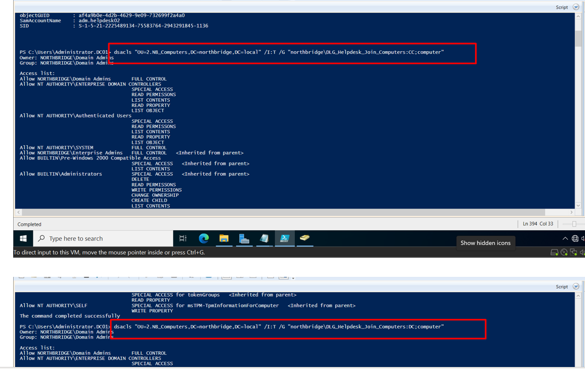

The delegation grants the following capabilities:

- Create computer objects in the domain  
- Delete computer objects when needed  

This aligns with how Helpdesk operations typically work in real environments, where the focus is on managing objects rather than modifying internal attributes.

To confirm that the delegation was correctly applied, the permissions were validated using `dsacls` filtering.

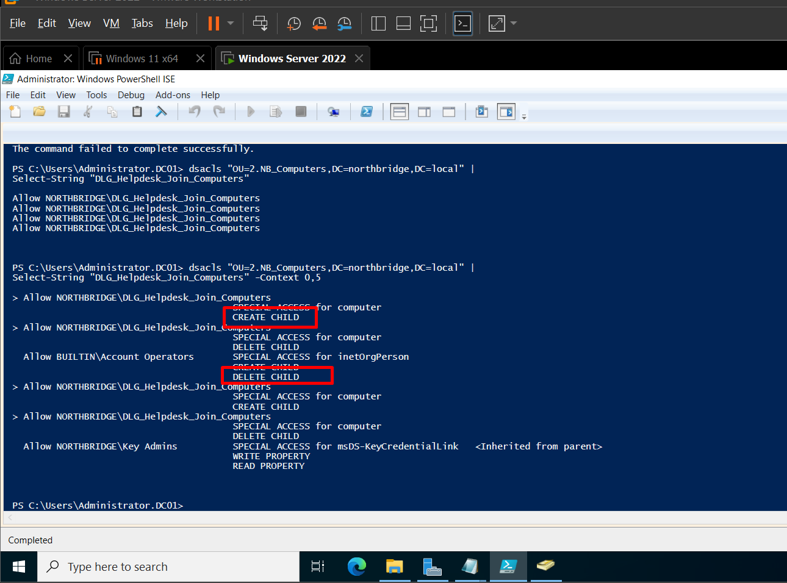

The output confirms that the Helpdesk delegation group has:

- `CREATE CHILD` (CC) — ability to create computer objects  
- `DELETE CHILD` (DC) — ability to remove computer objects  

This ensures that Helpdesk users can successfully join machines to the domain without requiring Domain Admin privileges, while still keeping control scoped and secure.

---

### 9: Helpdesk Read Login Attributes

Allowed read-only access to attributes used for troubleshooting login issues.

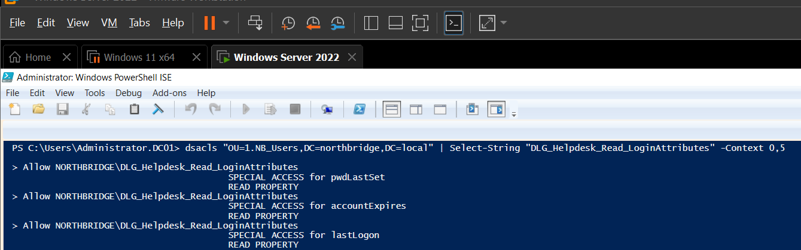

---

### 10: Helpdesk Move Users

Delegated the ability to move users between OUs.

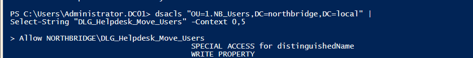

---

### 11: HR Modify Users

HR can update:

- Title  
- Department  
- Manager  
- Description  

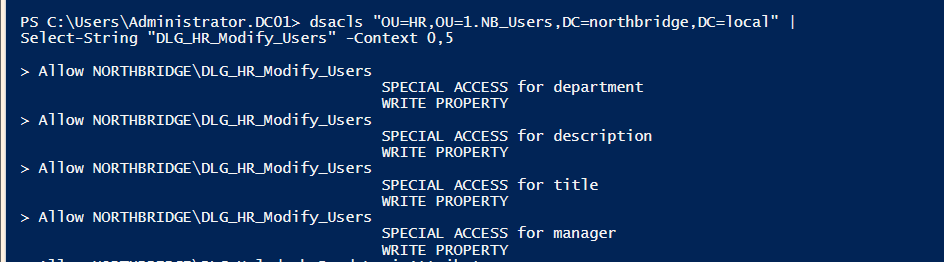

---

### 12: HR Disable Accounts

Delegated the ability to disable user accounts for offboarding.

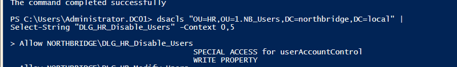

---

### 13: HR Create and Delete Users

Allowed HR to create and delete users within their scoped OU.

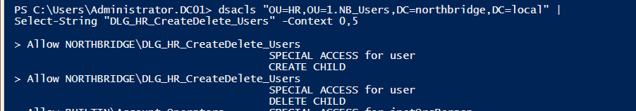

---

### 14: HR Move Disabled Users

Created a DisabledUsers OU and delegated movement into it.

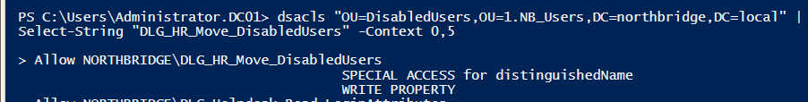

---

### 15: Manager Read Attributes

Managers can view key attributes like department and manager relationships.

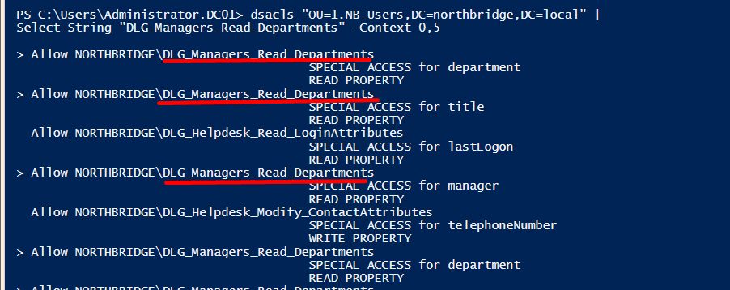

---

### 16: Manager Read Group Membership

Managers can validate group membership without modifying it.

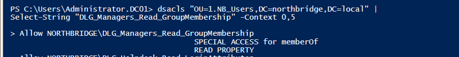

---

## Validation / Testing

### Helpdesk Tests (Client Machine)

Logged in as:
northbridge\adm.helpdesk01

Validated:

- Password reset → worked  
- Reading attributes → worked  
- Changing department → denied  

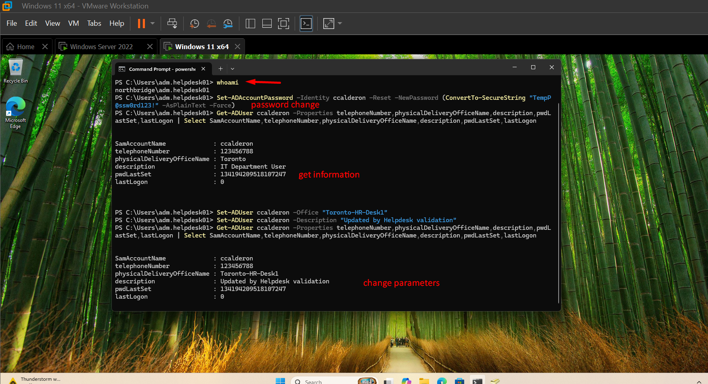  
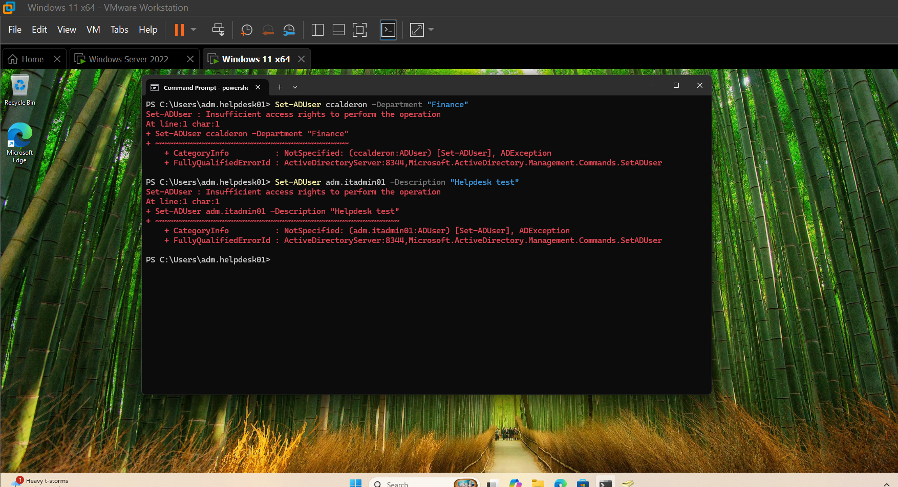

---

### HR Tests (Client Machine)

Logged in as:
northbridge\mlopez

Validated:

- Modify Title/Department → worked  
- Disable account → worked  
- Reset password → denied  

During testing, creating users sometimes returned **“Access Denied”** but the user was still created.  
This helped confirm that permissions were partially correct and required careful validation.

  
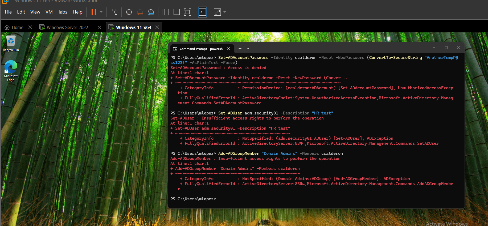

---

### Manager Read-Only Validation

Managers were able to read:

- direct reports  
- department structure  

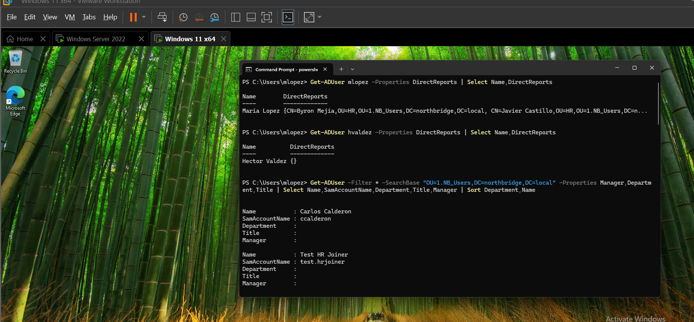

An additional validation was performed attempting to modify user attributes, which resulted in an access denied error.

This confirmed that the role is properly restricted to read-only access.

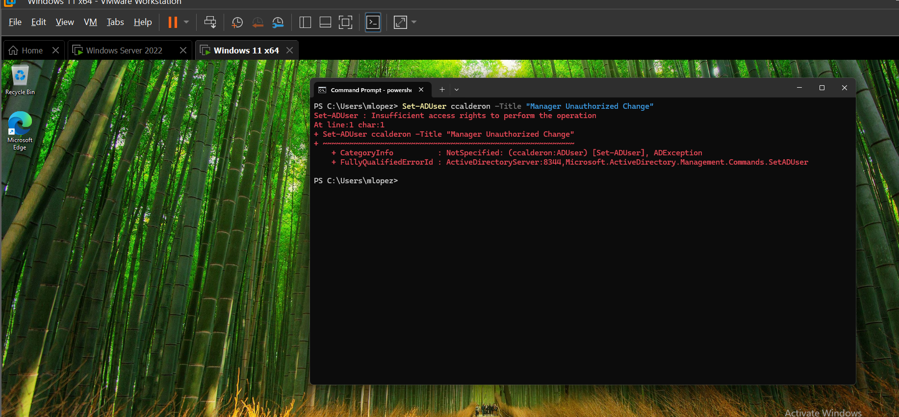

---

### Audit Validation (Domain Controller)

Audit logs were collected directly from the domain controller.

Password reset events:

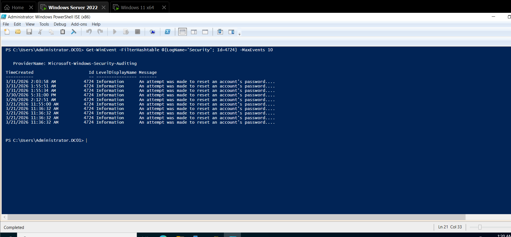

Additional events validated:

- Account disabled  
- User changes  

This confirmed that delegated actions are properly logged.

---

### Automation Readiness

Validated that all users contain structured attributes:

- Department  
- Title  
- Manager  

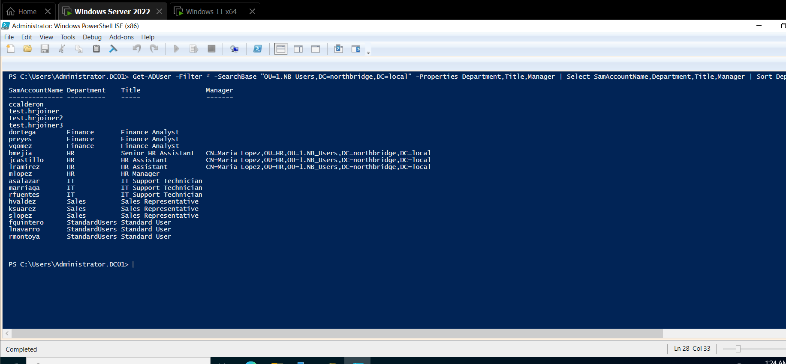

This shows the environment is ready for automation scenarios like:

- Joiner / Mover / Leaver processes  
- Azure AD / Entra ID sync  
- Access reviews  

---

## Key Concepts Applied

- Role-Based Access Control (RBAC)  
- Least Privilege  
- Separation of Duties  
- OU-based delegation  
- Identity lifecycle management  
- Audit logging  

---

## What I Learned

This project helped me understand that delegation is not just about assigning permissions.

Some things that stood out:

- Permissions may appear to fail but still partially work, so validation is critical  
- Testing from the correct account (Helpdesk vs HR vs Admin) makes a big difference  
- The domain controller is always the source of truth for audit logs  
- Using groups instead of users simplifies everything later  
- Small mistakes in delegation can create unexpected behavior  

If I were to improve this, I would automate more of the validation and integrate it with scripts.

---

## Real-World Relevance

This is very similar to how companies manage Active Directory:

- Helpdesk handles daily support  
- HR manages user lifecycle  
- Managers validate access without modifying it  

This kind of delegation model is used in:

- IT support environments  
- enterprise identity management  
- compliance and audit processes  

---

## Skills Demonstrated

- Active Directory administration  
- PowerShell automation  
- RBAC design  
- Security delegation  
- Troubleshooting permissions  
- Audit validation  

---

## Technologies Used

- Windows Server 2022  
- Active Directory Domain Services  
- Windows 11  
- PowerShell  
- DSACLS  
- RSAT  
- Event Viewer  

---

