# Identity Lifecycle Management — Active Directory (Northbridge Lab)

## Project Overview

This project simulates how identity lifecycle is managed in a real Active Directory environment using a structured and controlled approach.

Instead of focusing only on creating and deleting users, the implementation follows a full lifecycle model that reflects how organizations manage identities over time:

- Users are onboarded with defined roles and access
- Access is updated when roles change
- Accounts are securely handled when users leave

The goal was to build a system where identity data, access permissions, and organizational structure stay aligned at all times. This helps reduce security risks, improves consistency, and prepares the environment for automation.

---

## Objectives

- Implement a complete Joiner–Mover–Leaver lifecycle model  
- Apply Role-Based Access Control (RBAC) for managing permissions  
- Maintain consistency between user attributes, group membership, and OU placement  
- Prevent privilege accumulation during role changes  
- Ensure all lifecycle actions can be validated and audited  
- Build a structure that can support automation and scaling  

---

## Environment / Architecture

- Domain: northbridge.local  
- Platform: Windows Server 2022  
- Directory Service: Active Directory Domain Services (AD DS)  
- Management: PowerShell + RSAT  

The environment was designed using a structured OU model that separates users by department and isolates system components.

This setup was chosen because it reflects how enterprise environments organize identities. It allows administrative control to be scoped properly and ensures policies and permissions can be applied consistently across departments.

---

## Design Decisions

### Organizational Structure

Users are organized into departmental OUs (HR, Finance, IT, Sales).  
This ensures that identity placement matches business roles and allows policies to be applied logically.

A dedicated `DisabledUsers` OU is used to isolate inactive accounts.  
This prevents confusion between active and inactive users and improves audit visibility.

---

### RBAC (Role-Based Access Control)

Access is managed through security groups instead of assigning permissions directly to users.

This approach makes access easier to maintain and reduces errors when users change roles. Instead of modifying permissions manually, access changes are handled through group membership updates.

---

### Identity Attributes as Source of Truth

Attributes such as department, title, and manager are treated as authoritative identity data.

These attributes drive access decisions, reporting, and automation. Keeping them accurate ensures that the environment behaves predictably.

---

### Lifecycle Consistency

Every lifecycle action updates three things:

- Identity attributes  
- Group membership  
- Organizational placement  

This prevents mismatches where a user’s role does not align with their access or location in the directory.

---

## Implementation

### 1: Environment Validation

The directory structure was validated to confirm that all organizational units exist and follow the expected hierarchy.

This step ensures that lifecycle operations can be applied without structural inconsistencies later.

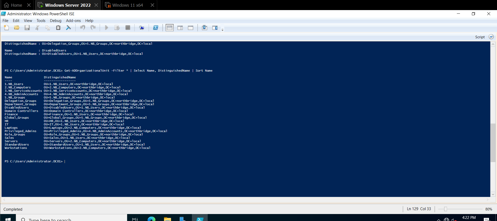

---

### 2: Reviewing Existing Identities

Existing users were reviewed to understand how identity attributes and manager relationships were configured.

This helps identify inconsistencies early and ensures that changes are applied on a stable baseline.

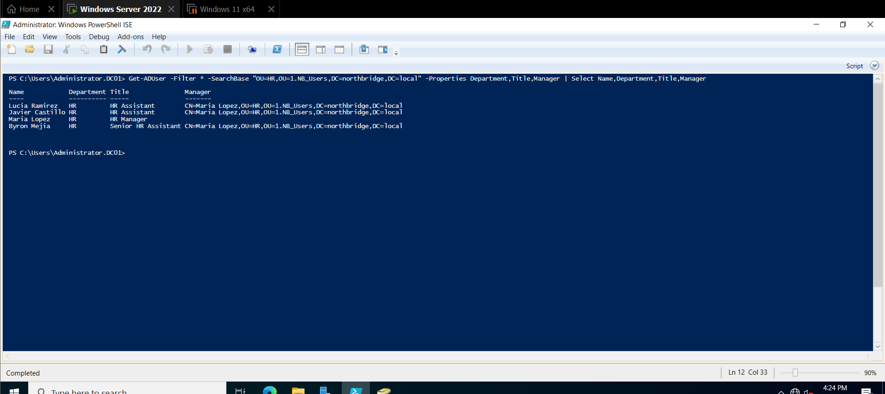

---

### 3: Preparing Lifecycle Structure

A dedicated OU for disabled users was created.

Separating inactive accounts improves organization and prevents accidental reuse of accounts, which is important for both security and compliance.

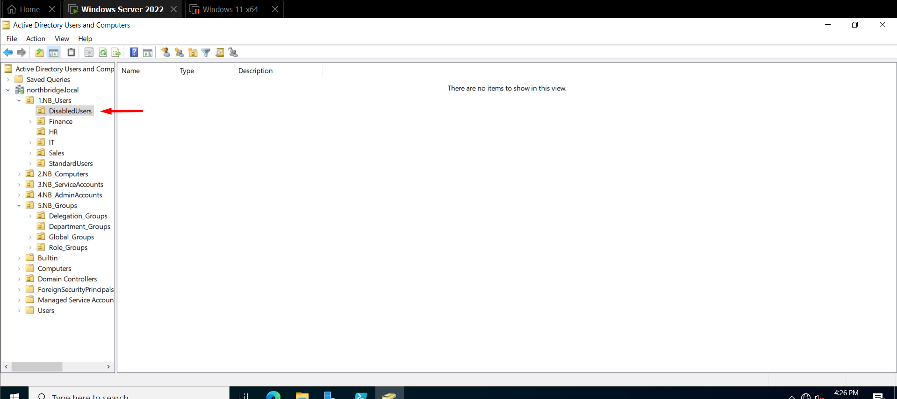

---

### 4: Reviewing RBAC Groups

The RBAC group structure was reviewed to confirm that access is managed through groups.

This ensures that permissions can be adjusted dynamically as users move between roles without requiring manual changes.

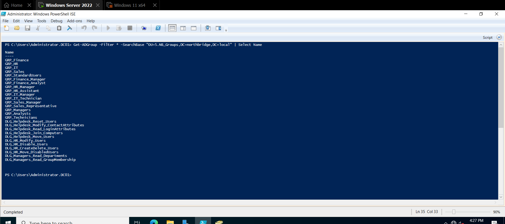

---

### 5: Creating a New User (Joiner)

A new user was created in the HR OU.

Placing the user in the correct OU from the beginning ensures that policies and administrative scope are applied correctly.

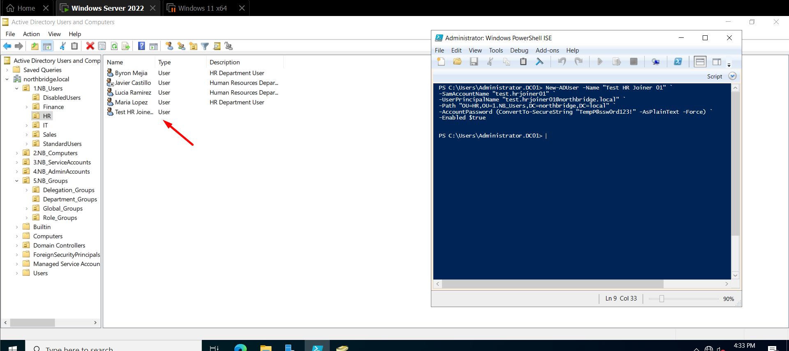

---

### 6: Assigning Identity Attributes

The user was assigned department, job title, and manager attributes.

These attributes define the user’s identity within the organization and are used for access decisions and reporting.

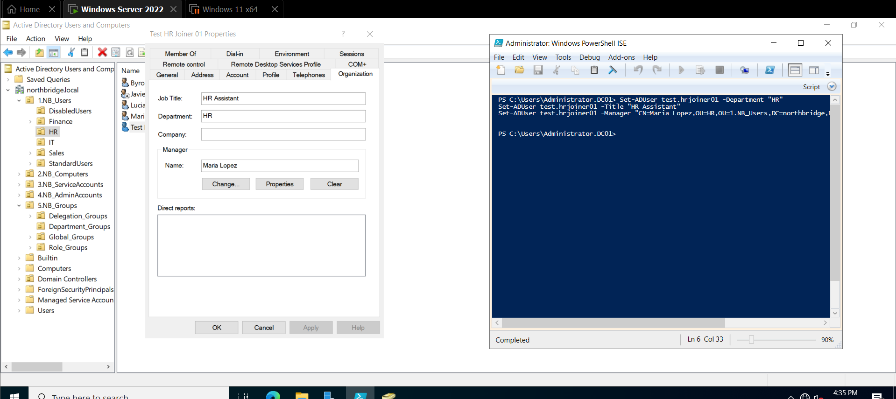

---

### 7: Assigning Group Membership

The user was added to department and standard access groups.

Using groups instead of direct permissions ensures consistency and allows access to scale without manual reconfiguration.

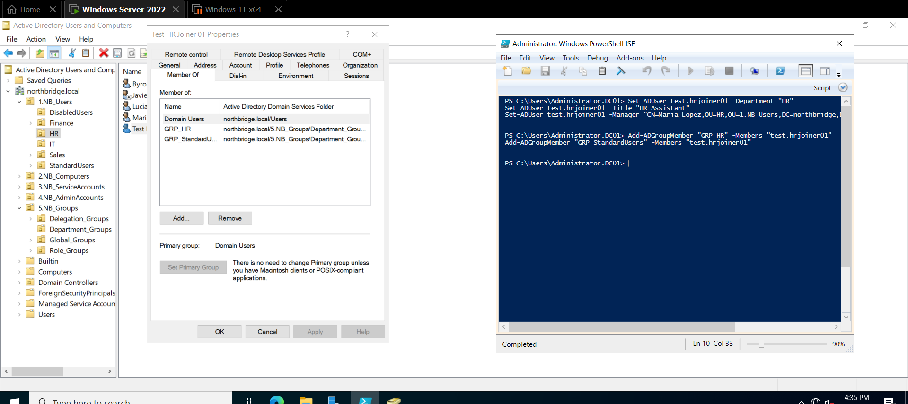

---

### 8: Validation of Onboarding

The account was validated to confirm that it is active and correctly configured.

This step ensures the onboarding process was completed successfully and the user is ready to operate.

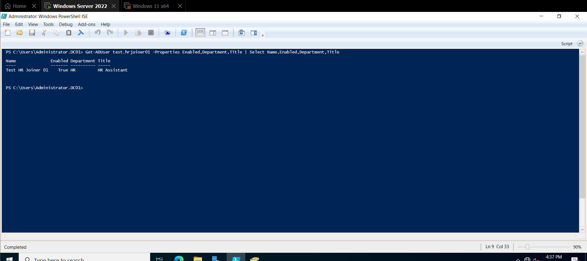

---

### 9: Capturing Initial State (Mover)

Before applying a role change, the user’s current attributes and access were documented.

This provides a clear baseline to compare against after the transition.

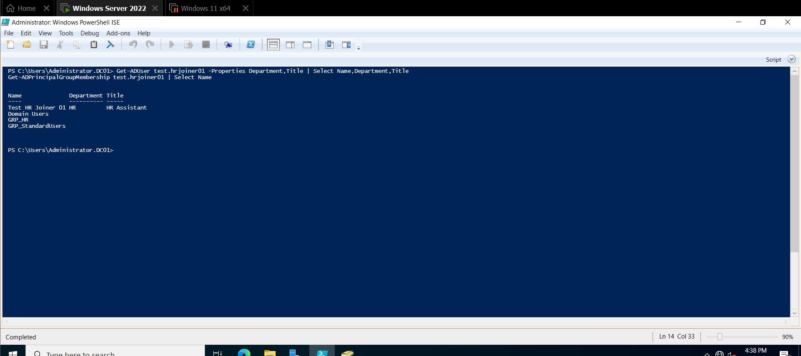

---

### 10: Updating Identity Attributes (Mover)

The user transitioned from HR to Finance, and attributes such as department, title, and manager were updated.

Updating identity data ensures that access reflects the new role and that reporting structures remain accurate.

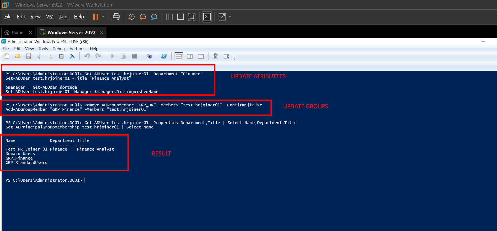

---

### 11: Updating Group Membership

Old access was removed and replaced with new group memberships aligned with the Finance role.

This prevents privilege accumulation and ensures the user only has access relevant to their current responsibilities.

---

### 12: Updating Organizational Placement

The user was moved from the HR OU to the Finance OU.

Keeping OU placement aligned with the user’s role ensures consistency and supports policy enforcement.

---

### 13: Validating Role Change

The user was validated to confirm that attributes, group memberships, manager assignment, and OU placement are all consistent.

This ensures the role transition is fully applied.

---

### 14: Capturing Pre-Offboarding State

Before offboarding, the user’s current state was reviewed.

This provides visibility into existing access and supports validation of the offboarding process.

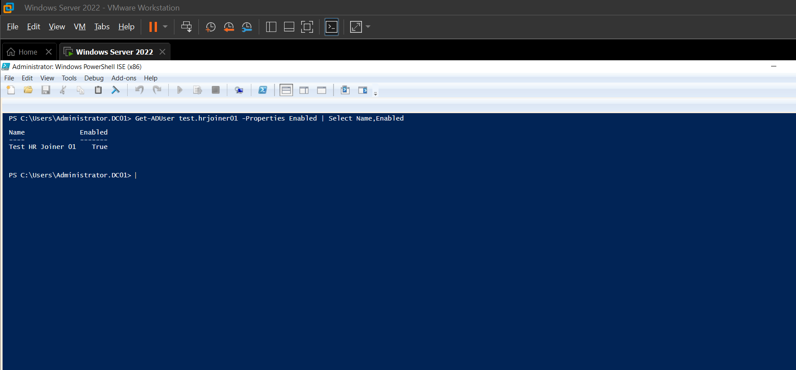

---

### 15: Disabling the Account

The account was disabled to immediately revoke access.

Disabling accounts preserves data while ensuring that access is no longer possible.

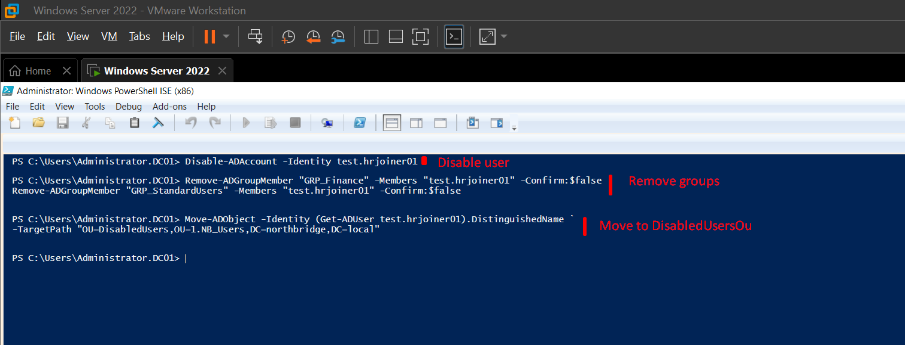

---

### 16: Removing Access

All group memberships were removed.

This ensures that no permissions remain assigned to the user after offboarding.

---

### 17: Moving to Disabled OU

The account was moved to the DisabledUsers OU.

This keeps inactive accounts separated and improves visibility and control.

---

### 18: Offboarding Validation

The final validation confirms that the account is disabled, has no active access, and is correctly placed.

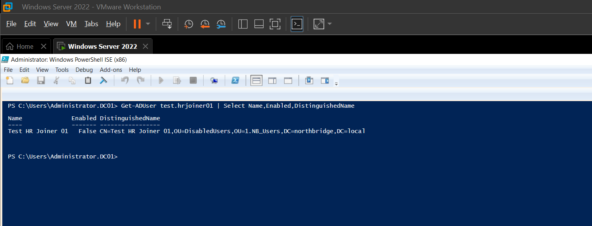

---

### 19: Manager Reporting Structure

Manager relationships were validated to ensure reporting structures are accurate.

This is important for approvals, access reviews, and organizational visibility.

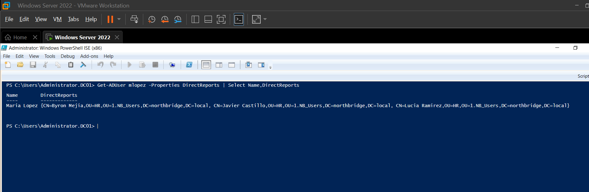

---

### 20: Audit — User Created

User creation events were reviewed in security logs.

This ensures that onboarding actions are traceable and accountable.

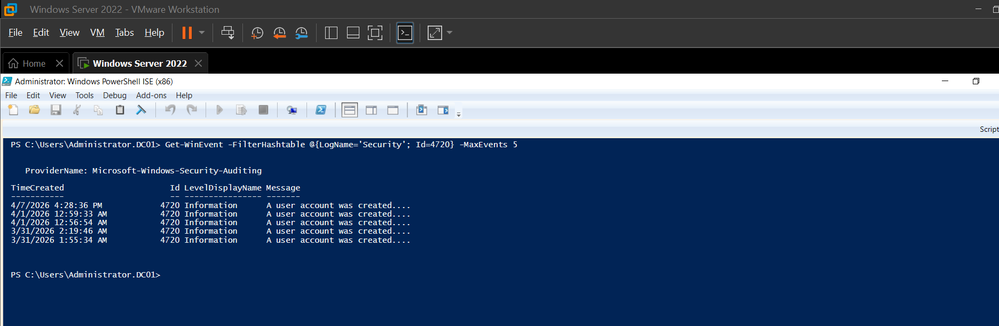

---

### 21: Audit — User Modified

Changes to user accounts were reviewed to confirm that role updates are recorded.

This provides visibility into lifecycle changes.

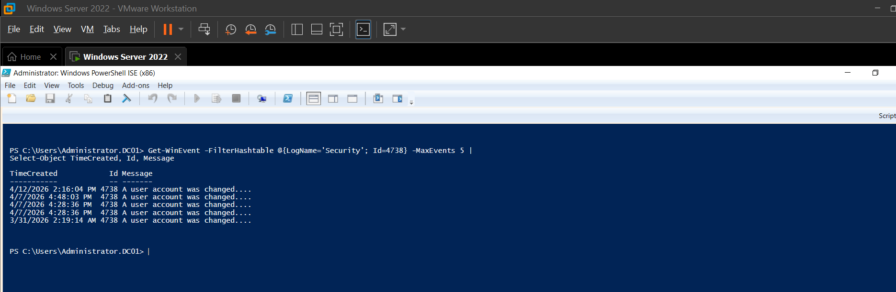

---

### 22: Audit — User Disabled

Offboarding actions were validated through audit logs.

This confirms that account disable operations are properly recorded.

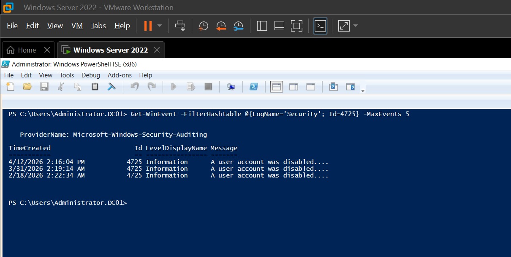

---

### 23: Automation Readiness

The final state of the environment was reviewed to ensure consistency across identities.

This makes the environment ready for automation, reporting, and integration with other systems.

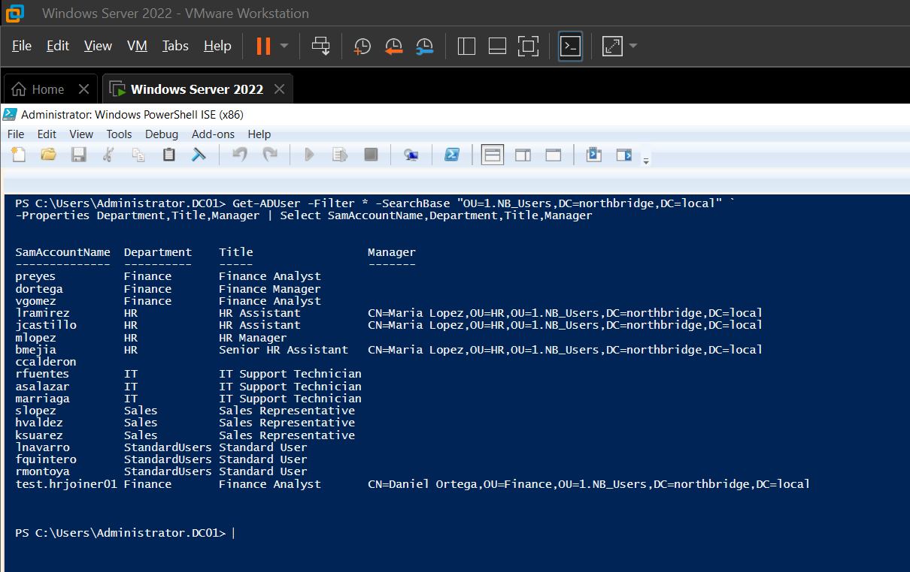

---

## Validation / Testing

Validation was performed after each lifecycle stage to ensure consistency.

Checks included:

- Verifying user attributes (department, title, manager)  
- Confirming group membership alignment  
- Ensuring correct OU placement  
- Reviewing audit logs for lifecycle actions  

Validation is important because it confirms that identity, access, and structure are aligned. Without it, inconsistencies can lead to security risks or operational issues.

---

## Key Concepts Applied

- Identity and Access Management (IAM): Managing identities across their lifecycle  
- RBAC: Assigning access through groups instead of individual permissions  
- Active Directory OU Design: Structuring users logically by department  
- Least Privilege: Ensuring users only have access required for their role  
- Auditing: Tracking changes for accountability and compliance  

---

## What I Learned

One of the biggest challenges was understanding that identity lifecycle is not just about changing attributes or moving users. Every change has to be consistent across multiple layers.

At first, it was easy to update attributes without thinking about group membership or OU placement. After working through the full lifecycle, it became clear that all three must always stay aligned.

I also gained a better understanding of how RBAC simplifies access management and why it is critical in larger environments.

If I were to improve this project, I would extend it with automation scripts to handle onboarding and role changes dynamically.

---

## Real-World Relevance

This type of lifecycle management is used in enterprise environments to:

- Onboard employees with the correct access  
- Update permissions when roles change  
- Securely offboard users leaving the company  

Understanding this process is essential for IT support, system administration, and identity management roles because it directly impacts security and operational efficiency.

---

## Skills Demonstrated

- Active Directory Administration  
- Identity Lifecycle Management  
- RBAC Implementation  
- PowerShell-based management approach  
- Troubleshooting and validation  
- Security and access control principles  

---

## Technologies Used

- Windows Server 2022  
- Active Directory Domain Services (AD DS)  
- PowerShell  
- RSAT Tools  
