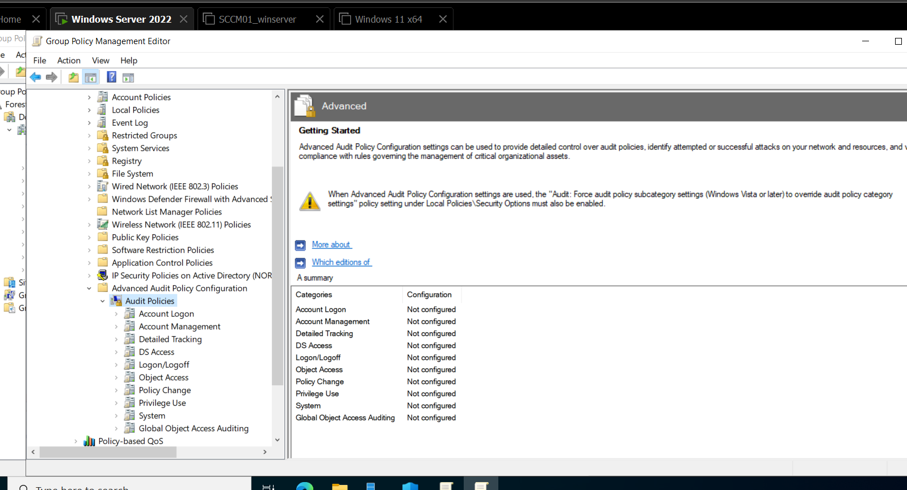
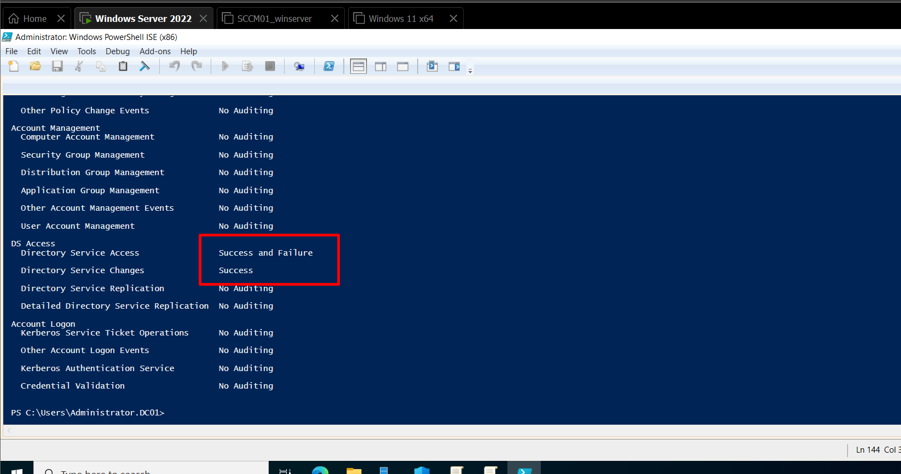
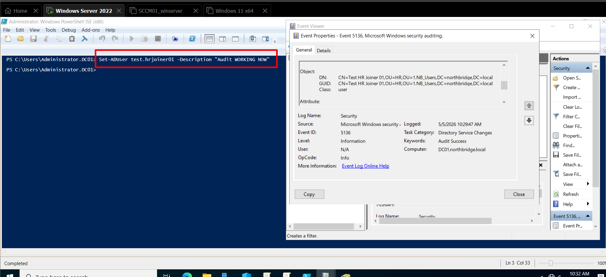
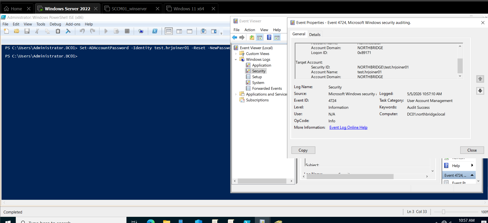
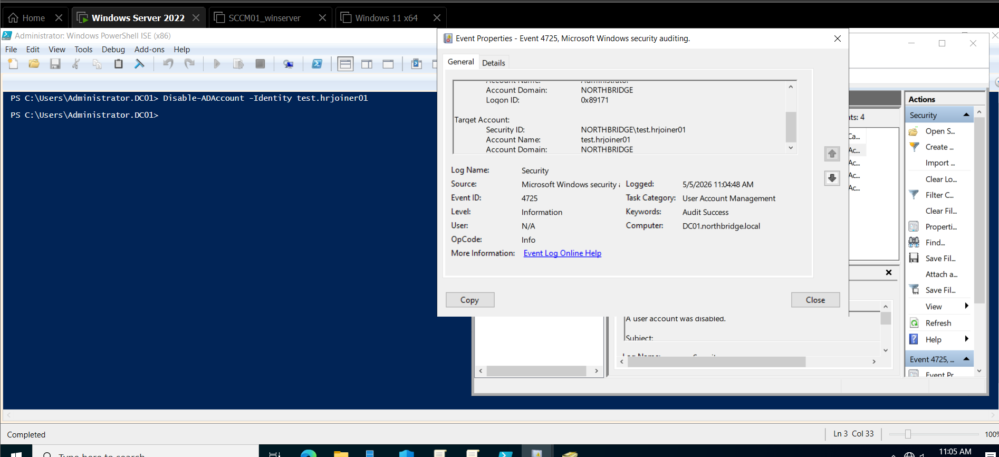
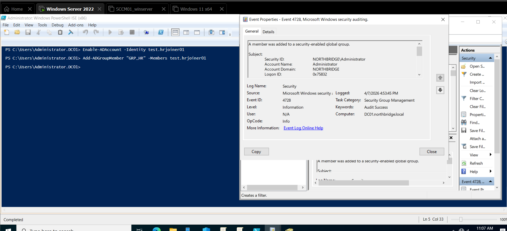
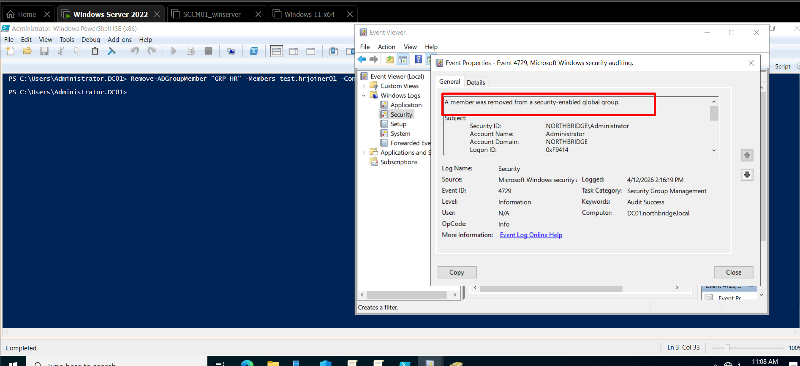
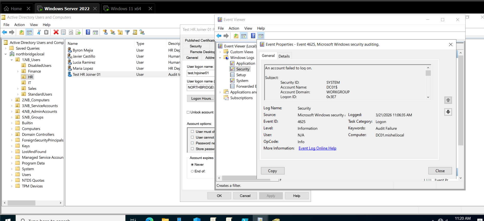
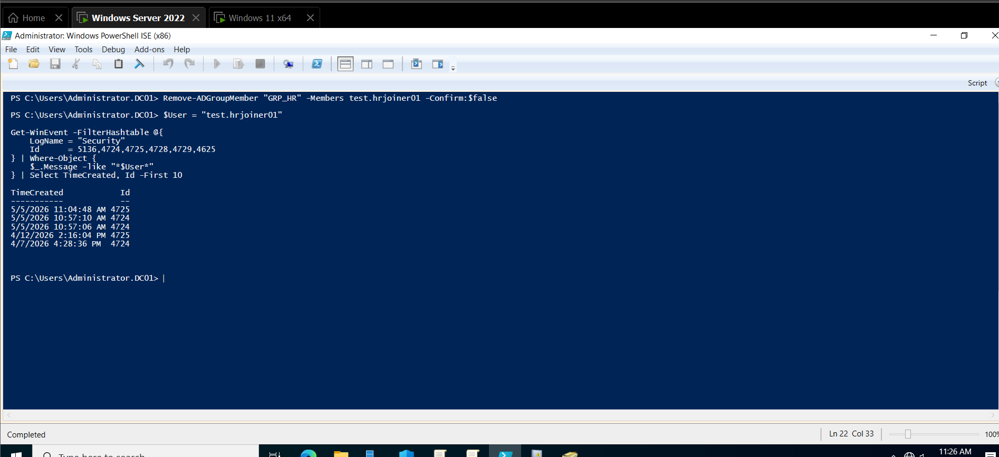

# Logs & Auditing in Active Directory

## Overview

In this section, I focused on implementing auditing in Active Directory to gain visibility into what is actually happening inside the environment. Up to this point, the infrastructure already had RBAC, delegation, and organizational structure in place. However, without auditing, there is no way to validate or prove how those controls are being used.

The purpose of this implementation is to ensure that every critical identity-related action is traceable. This includes understanding who made a change, what was modified, and when it happened. This level of visibility is essential in real-world environments for security monitoring, troubleshooting, and compliance.

---

## Why Auditing Matters

In an enterprise environment, identity is one of the most sensitive layers. Actions like resetting a password, modifying a user, or adding someone to a group can directly impact access to systems and data.

Without auditing:
- There is no accountability  
- Changes cannot be investigated  
- Security incidents cannot be traced  

With auditing properly configured:
- Every action is recorded  
- Administrative behavior is visible  
- Security events can be analyzed  

This is what transforms a basic Active Directory setup into something that is actually production-ready.

---

## Implementation Approach

The auditing configuration was designed with a clear goal: capture only meaningful and actionable events. Instead of enabling everything, which would generate excessive noise, the focus was placed on identity lifecycle and security-relevant activities.

The implementation was done using Advanced Audit Policy through Group Policy, ensuring centralized and consistent configuration across the domain controllers.

📸  

The selected audit categories were:

- Directory Service Access → to track object-level changes  
- Account Management → to monitor user and group operations  
- Logon/Logoff → to capture authentication activity  
- Policy Change → to detect modifications in audit or security policies  

This selection ensures coverage of the most critical identity and security operations without overwhelming the logs.

---

## Validation of Audit Configuration

After applying the policy, it was important to confirm that auditing was actually active. This step validates that the configuration is not only set but also enforced by the system.

📸  

This verification step is essential because, in real environments, misconfigurations or conflicts can prevent audit policies from being applied correctly.

---

## Auditing Directory Changes (Event ID 5136)

A controlled modification was performed on a user account to validate directory-level auditing.

📸  

This event demonstrates that:
- Active Directory object changes are being recorded  
- The system captures both the attribute modified and the new value  
- The identity of the administrator performing the action is logged  

This is one of the most important audit events because it provides deep visibility into how objects are being modified over time.

---

## Auditing Password Resets (Event ID 4724)

A password reset operation was executed to simulate a typical helpdesk action.

📸  

This validates that:
- Password management activities are fully traceable  
- Administrative actions affecting user access are logged  
- Identity lifecycle operations are visible  

Even though the event message refers to an “attempt,” it represents a successful administrative action and is critical for tracking support operations.

---

## Auditing Account Disable Actions (Event ID 4725)

The user account was disabled to simulate an offboarding scenario.

📸  

This demonstrates that:
- Account status changes are recorded  
- Administrative control over user access is traceable  
- Offboarding actions can be audited  

This type of event is particularly important in environments where access revocation must be controlled and documented.

---

## Auditing Group Membership Changes (Event ID 4728 / 4729)

User access was modified through group membership changes.

📸  

📸  

These events validate that:
- Access control through groups (RBAC) is fully auditable  
- Any privilege change can be tracked  
- Unauthorized access changes can be detected  

Since group membership directly controls access to resources, auditing these events is critical for security.

---

## Detecting Failed Logons (Event ID 4625)

A failed login attempt was generated intentionally to simulate incorrect authentication.

📸  

This confirms that:
- Authentication failures are recorded  
- Suspicious login attempts can be detected  
- The system can support security monitoring use cases  

This type of event is commonly used to identify brute force attacks or unauthorized access attempts.

---

## Log Analysis Using PowerShell

To complement the graphical analysis, logs were queried using PowerShell.

📸  

This demonstrates that:
- Logs can be filtered programmatically  
- Multiple event types can be analyzed together  
- The environment is ready for integration with monitoring or SIEM tools  

This approach reflects how logs are handled in real environments, where automation and scalability are required.

---

## Key Takeaways

- Auditing must be intentional and focused on critical events  
- Advanced Audit Policy provides the necessary granularity for enterprise environments  
- SACL configuration is required to capture object-level changes in Active Directory  
- Identity-related events provide the most value for both operations and security  
- Combining Event Viewer and PowerShell creates a more complete analysis capability  

---

## Conclusion

This implementation shows how Active Directory can be configured to provide meaningful auditing across identity operations. More importantly, it demonstrates that the environment is not only functional, but also observable and traceable.

At this point, the infrastructure supports:

- Visibility into administrative actions  
- Traceability of identity changes  
- Detection of authentication issues  
- Audit readiness for real-world scenarios  

This is a key step in moving from a basic lab setup to an environment aligned with enterprise security practices.
