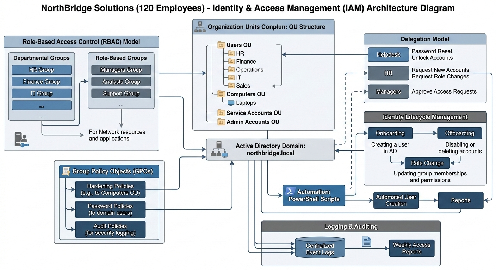

# Identity & Access Management System – NorthBridge Solutions  
### A practical IAM project for a mid-sized fictional company

This project shows how an IT team could design and manage an Identity & Access Management (IAM) environment for *NorthBridge Solutions*, a company with around 120 employees.  
The goal is to present a realistic setup using Active Directory, security policies, automation, and clear operational processes.

---

## 📌 Architecture Overview

The diagram below gives a quick visual idea of how the IAM environment is organized and how the main components connect to each other.

---

## 🎯 Project Goals

- Build a clean and scalable Active Directory structure  
- Apply security policies that match real company needs  
- Delegate basic tasks to Helpdesk, HR, and Managers  
- Standardize onboarding, offboarding, and role changes  
- Automate repetitive tasks with PowerShell  
- Improve visibility and auditing across the environment  

---

## 📁 Repository Structure

| Folder | Description |
|--------|-------------|
| **03-ActiveDirectory-Design/** | OU structure, RBAC model, groups and roles |
| **04-Security-Policies/** | GPOs, hardening, and auditing setup |
| **05-Delegation-Model/** | Delegation for Helpdesk, HR, and Managers |
| **06-Identity-Lifecycle/** | Onboarding, offboarding, and role change workflows |
| **07-Automation/** | PowerShell scripts and automated reports |
| **08-Logs-and-Auditing/** | Audit configuration and sample logs |
| **09-Documentation/** | SOPs, runbooks, glossary, and diagrams |

---

## 🏗️ Technologies Used

- Active Directory (On-Prem)  
- Group Policy Objects (GPOs)  
- PowerShell  
- Windows Server  
- RBAC (Role-Based Access Control)  
- Event Auditing  

---

## 📈 Key Results

- Onboarding time reduced by about **70%**  
- More consistent and predictable permission assignments  
- Clear separation of responsibilities through delegation  
- Better visibility into inactive accounts and access changes  
- Stronger security posture with documented processes  

---

